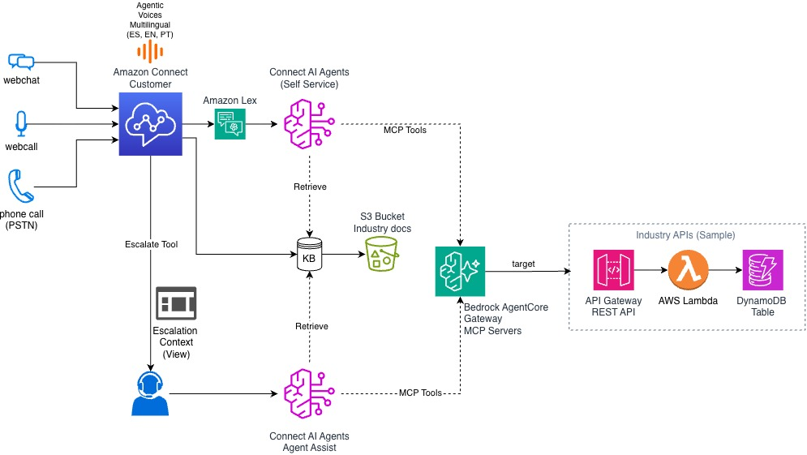

# Amazon Connect — Agentic Customer Experience PoC

> **Autoservicio inteligente, omnicanal y multiindustria** con Amazon Connect AI Agents, AI Agent Assist, y Bedrock AgentCore MCP.

Este repositorio contiene una prueba de concepto completa que demuestra cómo resolver los desafíos más comunes de los contact centers usando capacidades agénticas de Amazon Connect. Cada industria (telco, banco, aerolínea) re-tematiza la misma arquitectura de referencia con datos y experiencias de dominio específicas, compartiendo una sola instancia de Connect.

---

## Desafíos y Soluciones

<table>
<tr>
<td width="50%" style="background-color:#fce4e4; vertical-align:top; padding:16px; color:#1a1a1a;">

### Desafío

Las atenciones simples requieren esperar a un agente humano, con disponibilidad limitada en horario 9-5.

</td>
<td width="50%" style="background-color:#e4fce4; vertical-align:top; padding:16px; color:#1a1a1a;">

### Solución

**Autoservicio agéntico omnicanal 24/7** — Amazon Connect AI Agents resuelven consultas de principio a fin por voz y chat, sin intervención humana. El agente consulta sistemas backend (MCP tools), busca en la base de conocimiento, y solo escala cuando realmente no puede resolver.

</td>
</tr>
</table>

---

<table>
<tr>
<td width="50%" style="background-color:#fce4e4; vertical-align:top; padding:16px; color:#1a1a1a;">

### Desafío

IVRs estáticos sin flexibilidad: árboles de menú rígidos que frustran al cliente y no se adaptan al contexto de la conversación.

</td>
<td width="50%" style="background-color:#e4fce4; vertical-align:top; padding:16px; color:#1a1a1a;">

### Solución

**Atención agéntica conversacional** — En lugar de "Presione 1 para...", el cliente expresa lo que necesita en lenguaje natural. El AI Agent entiende la intención, mantiene el contexto de la conversación, accede a herramientas y resuelve sin árboles de menú rígidos. La experiencia se adapta dinámicamente a lo que dice el cliente: sin menús, sin frustración.

</td>
</tr>
</table>

---

<table>
<tr>
<td width="50%" style="background-color:#fce4e4; vertical-align:top; padding:16px; color:#1a1a1a;">

### Desafío

Voces robóticas y monótonas que no generan confianza ni cercanía con el cliente.

</td>
<td width="50%" style="background-color:#e4fce4; vertical-align:top; padding:16px; color:#1a1a1a;">

### Solución

**Voces agénticas de nueva generación** — Las nuevas voces agénticas de Amazon Connect son expresivas y políglota: hablan con entonación y ritmo naturales, adaptándose al contexto de la conversación para generar confianza y cercanía. Una misma voz maneja español, inglés y portugués, y la solución se puede extender a **más de 38 idiomas y más de 100 combinaciones de localización** sin rehacer el flujo.

</td>
</tr>
</table>

---

<table>
<tr>
<td width="50%" style="background-color:#fce4e4; vertical-align:top; padding:16px; color:#1a1a1a;">

### Desafío

El autoservicio no puede acceder a sistemas internos: el bot responde preguntas genéricas pero no puede consultar saldos, hacer reservas, ni ejecutar acciones reales.

</td>
<td width="50%" style="background-color:#e4fce4; vertical-align:top; padding:16px; color:#1a1a1a;">

### Solución

**Herramientas y conocimiento de dominio** — El AI Agent va más allá de responder preguntas genéricas: consulta los sistemas de negocio en tiempo real mediante **herramientas MCP de propósito específico para cada industria** (consultar cuentas, listar vuelos o productos, crear reservas) y se apoya en **bases de conocimiento del dominio** (multilingües) para resolver con precisión. Al combinar acción y conocimiento, las atenciones agénticas simples se resuelven de forma autónoma, **liberando carga de los agentes humanos** y ayudando a los clientes a **resolver antes**.

</td>
</tr>
</table>

---

<table>
<tr>
<td width="50%" style="background-color:#fce4e4; vertical-align:top; padding:16px; color:#1a1a1a;">

### Desafío

Cuando el autoservicio no puede resolver, el cliente es transferido a un agente humano sin contexto — y tiene que repetir todo desde cero.

</td>
<td width="50%" style="background-color:#e4fce4; vertical-align:top; padding:16px; color:#1a1a1a;">

### Solución

**Escalación con contexto completo** — Al escalar, el AI Agent registra un `escalationSummary` con lo que se intentó y por qué se escala. El agente humano recibe un screen-pop con los datos del cliente, el resumen de la conversación y las herramientas del AI Agent a su disposición (AI Agent Assist).

</td>
</tr>
</table>

---

<table>
<tr>
<td width="50%" style="background-color:#fce4e4; vertical-align:top; padding:16px; color:#1a1a1a;">

### Desafío

Los agentes humanos pierden tiempo buscando información en múltiples sistemas mientras el cliente espera en la línea.

</td>
<td width="50%" style="background-color:#e4fce4; vertical-align:top; padding:16px; color:#1a1a1a;">

### Solución

**AI Agent Assist con sugerencias en tiempo real** — AI Agent Assist escucha la conversación y sugiere respuestas de la base de conocimiento, ejecuta herramientas MCP, y ofrece **guías paso a paso** cuando detecta un tema específico (p. ej. "maleta perdida" dispara automáticamente la guía de reporte de equipaje).

</td>
</tr>
</table>

---

<table>
<tr>
<td width="50%" style="background-color:#fce4e4; vertical-align:top; padding:16px; color:#1a1a1a;">

### Desafío

El soporte solo funciona en un idioma, excluyendo a una base de clientes diversa en Latinoamérica.

</td>
<td width="50%" style="background-color:#e4fce4; vertical-align:top; padding:16px; color:#1a1a1a;">

### Solución

**Atención multilingüe con cambio dinámico de idioma** — Las voces políglota de Amazon Connect cambian de idioma dinámicamente a mitad de la conversación, sin cambios de flujo. El AI Agent detecta el idioma del cliente desde la transcripción y responde en ese idioma automáticamente.

</td>
</tr>
</table>

---

## Arquitectura



### Cómo funciona

El diagrama muestra el recorrido de una atención de principio a fin:

1. **Entrada omnicanal** — El cliente contacta por webchat, webcall o llamada telefónica (PSTN). Todos los canales llegan a una **única instancia de Amazon Connect**, con voces agénticas multilingües (ES, EN, PT).
2. **Autoservicio agéntico** — Connect enruta la conversación al **AI Agent de autoservicio**. El agente entiende la intención en lenguaje natural y decide cómo resolver.
3. **Conocimiento y acción** — Para resolver, el agente combina dos capacidades reutilizables: **Retrieve** sobre una base de conocimiento (documentos de industria) y **MCP Tools** expuestas por un gateway de Bedrock AgentCore, que enruta hacia las APIs de negocio de cada industria.
4. **Escalación con contexto** — Cuando el agente no puede resolver, invoca la **Escalate Tool**: se arma un contexto de escalación (view) y la conversación pasa a un agente humano sin que el cliente tenga que repetir nada.
5. **Asistencia al agente humano** — Ya con el humano en línea, el **AI Agent Assist** acompaña la atención usando la **misma** base de conocimiento (Retrieve) y las **mismas** MCP Tools, sugiriendo respuestas y ejecutando acciones en tiempo real.

**Conceptualmente:** una sola instancia de Connect concentra todos los canales; un cerebro agéntico razona sobre la intención del cliente y orquesta dos recursos compartidos —conocimiento (KB) y herramientas (MCP)— tanto en autoservicio como en asistencia al humano. El mismo backend de conocimiento y las mismas herramientas sirven a ambos momentos de la atención.

**Beneficio:** las atenciones simples se resuelven solas 24/7, liberando a los agentes humanos para los casos complejos; y cuando hay escalación, el humano recibe todo el contexto y las mismas capacidades del agente, atendiendo más rápido y sin fricción para el cliente. La arquitectura es multiindustria: la misma base se re-tematiza (telco, banca, aerolínea) cambiando solo los datos y las herramientas de dominio.

**Por industria:**
- **Telco** → cuentas, planes, líneas móviles
- **Banco** → cuentas, productos financieros, tarjetas
- **Airline** → cuentas de viajero, vuelos disponibles, reservas

---

## Estructura del Repositorio

```
connect-customer-industry-poc/
├── general-localization/       # CX-LANG-UTILS — cola localizada, prompts/agentes i18n, logging
├── agentic-cx-telco/           # CX-TELCO-* (6 stacks) — demo telecomunicaciones
├── agentic-cx-bank/            # CX-BANCO-* (6 stacks) — demo banca
├── agentic-cx-airline/         # CX-AIRLINE-* (6 stacks) — demo aerolínea
├── cdk_constructs/             # Constructs CDK compartidos (AgentCore, Connect, webhosting)
├── instructions.md             # Guía de despliegue paso a paso
└── README.md                   # Este archivo
```

Cada app de industria contiene:
```
agentic-cx-{industria}/
├── config.py                   # Configuración centralizada (IDs, nombres, feature flags)
├── apis/                       # API Gateway REST API + OpenAPI spec
├── databases/                  # DynamoDB tables + seed data
├── lambdas/                    # Lambda handlers (por dominio)
├── connect_ai_agents/          # Prompts YAML de orquestación (voz/chat/assist)
├── connect/                    # Agent toolset (MCP tools + Retrieve + Escalate)
├── knowledge_bases/            # Artículos KB (es/pt/en) + scripts de tagging/asociación
├── flows/                      # Contact flows (JSON, Flow Language)
├── views/                      # Customer-managed views (formularios, guías paso a paso)
├── website/                    # Sitio estático (Vite) con widget de chat
└── agentic_cx_{industria}/     # CDK stacks (6 fases)
```

---

## Despliegue

Consulta **[instructions.md](./instructions.md)** para la guía completa de despliegue paso a paso, incluyendo:

- Prerrequisitos (CDK bootstrap, virtualenvs, credenciales)
- Creación de la instancia de Connect y el asistente de AI Agent Assist (Q in Connect)
- Despliegue de `general-localization` (una sola vez)
- Despliegue de cada industria (6 stacks por app)
- Post-despliegue: tagging de KB, asociación de guías, perfiles de seguridad, bot Lex, widget de chat

---

## Personalización

### Modificar los Prompts de los AI Agents

Los prompts de orquestación son archivos YAML que definen la personalidad, las reglas y el comportamiento del agente:

```
connect_ai_agents/{industria}-selfservice-voice/prompts/   # Prompt de voz
connect_ai_agents/{industria}-selfservice-chat/prompts/    # Prompt de chat
connect_ai_agents/{industria}-agent-assist-es/prompts/     # Prompt de agent-assist
```

Cada prompt tiene secciones editables:
- **`<identity>`** — Personalidad y tono del agente
- **`<core_behavior>`** — Reglas de negocio numeradas (identificación, escalación, confirmación)
- **`<customer_info>`** — Variables de sesión inyectadas por el flujo
- **`<security>`** — Guardrails (no revelar sistema, no dar consejos legales/médicos)

Después de editar un prompt: `cdk deploy CX-{INDUSTRIA}-AGENTS` y luego **publicar una nueva versión** del agente en la consola.

### Cambiar la Voz

La voz se configura en el **bot Lex V2** → cada locale → **Voice settings**:

1. En la consola de Amazon Lex → tu bot → cada locale → **Voice settings**
2. Selecciona una voz agéntica de nueva generación (políglota) o una voz específica del idioma
3. Recompila el locale

Las voces agénticas de nueva generación son expresivas y políglota — una sola voz maneja múltiples idiomas sin cambiar de locale, y la solución se puede extender a más de 38 idiomas y más de 100 combinaciones de localización.

### Modificar las Herramientas MCP

Las herramientas que el agente puede invocar se definen en dos lugares:

1. **`apis/openapi/openapi.yaml`** — El spec OpenAPI define las operaciones (cada `operationId` se convierte en una herramienta MCP)
2. **`connect/agent_tools.py`** — Las instrucciones y ejemplos por herramienta que guían al agente sobre cuándo y cómo usar cada tool

Para agregar una nueva herramienta: añade el endpoint en la API + Lambda, agrega el `operationId` al OpenAPI, regístralo en `config.AI_AGENT_MCP_OPERATIONS`, y añade la guía en `agent_tools.py`.

### Modificar la Knowledge Base

Los artículos viven en `knowledge_bases/{industria}/entries/{idioma}/` como archivos `.txt`. Para agregar contenido:

1. Crea un `.txt` en la carpeta del idioma correspondiente (es/, pt/, en/)
2. Redespliega `CX-{INDUSTRIA}-KB` (sube los archivos al bucket S3)
3. Espera el sync y ejecuta `python knowledge_bases/tag_kb_content.py --wait`

---

## Observabilidad

### Logging de AI Agents (CloudWatch)

El stack `CX-LANG-UTILS` configura la entrega centralizada de **EVENT_LOGS** del asistente de AI Agent Assist (Q in Connect) a CloudWatch Logs. Controlado por `config.ENABLE_AGENT_LOGS`:

- **Log group:** `/aws/connect/wisdom/{assistant-id}/event-logs`
- **Contenido:** Cada invocación del agente, tool calls, resultados de Retrieve, escalaciones, y completions
- **Uso:** Depurar por qué un agente eligió cierta herramienta, verificar que las citaciones son correctas, auditar escalaciones

### Visor de Datos Demo

Cada sitio web expone un endpoint `/datos` (Lambda + CloudFront) que renderiza las tablas DynamoDB del backend como HTML — útil para verificar que los datos semilla están correctos sin abrir la consola de DynamoDB.

### Contact Lens / Analytics

El flujo inbound habilita grabación y analítica por canal. Contact Lens proporciona transcripción en tiempo real, análisis de sentimiento, y detección de temas — integrado con el flujo de escalación.

---

## Decomisionar el Proyecto

Para eliminar todos los recursos desplegados:

```bash
# 1. Destruir los stacks de cada industria (en orden inverso)
cd agentic-cx-{industria}
source .venv/bin/activate
cdk destroy --all

# 2. Destruir general-localization
cd ../general-localization
source .venv/bin/activate
cdk destroy

# 3. Limpieza manual (si aplica):
#    - Eliminar el widget de chat en la consola de Connect
#    - Eliminar las content associations de la guía (associate_guide.py --delete, o manual)
#    - Vaciar los buckets S3 antes de destroy si CDK no puede eliminarlos
#    - Revisar que no queden security profiles huérfanos en la instancia
```

> **Nota:** Las tablas DynamoDB y los buckets S3 de la KB están configurados con `RemovalPolicy.DESTROY` (demo). En producción, cámbialos a `RETAIN`.

> **Orden de destrucción:** Destruye las industrias primero (sus flujos referencian el módulo init de `CX-LANG-UTILS`). Si destruyes `CX-LANG-UTILS` primero, el `cdk destroy` de la industria puede fallar al no encontrar el parámetro SSM `/flows/init/es`.

---

## Licencia

Este proyecto es una prueba de concepto para demostraciones. Consulta el archivo LICENSE (si existe) para los términos de uso.
