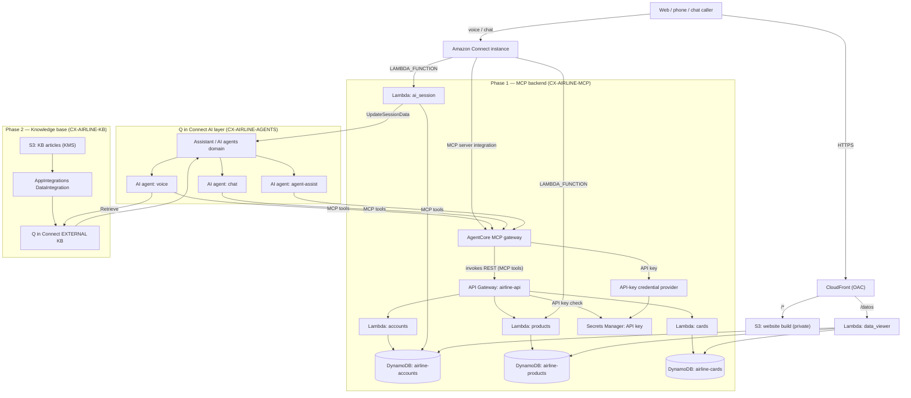
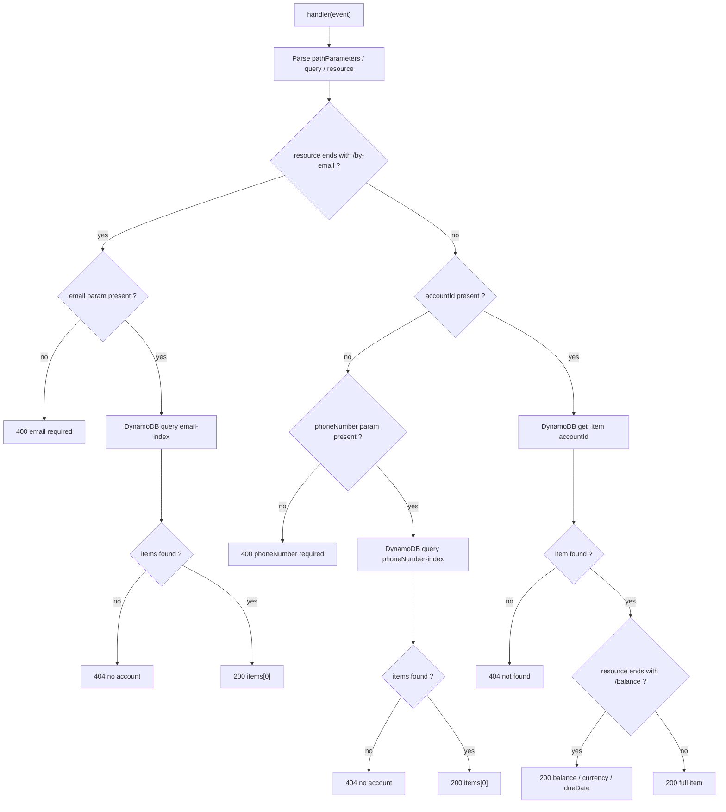
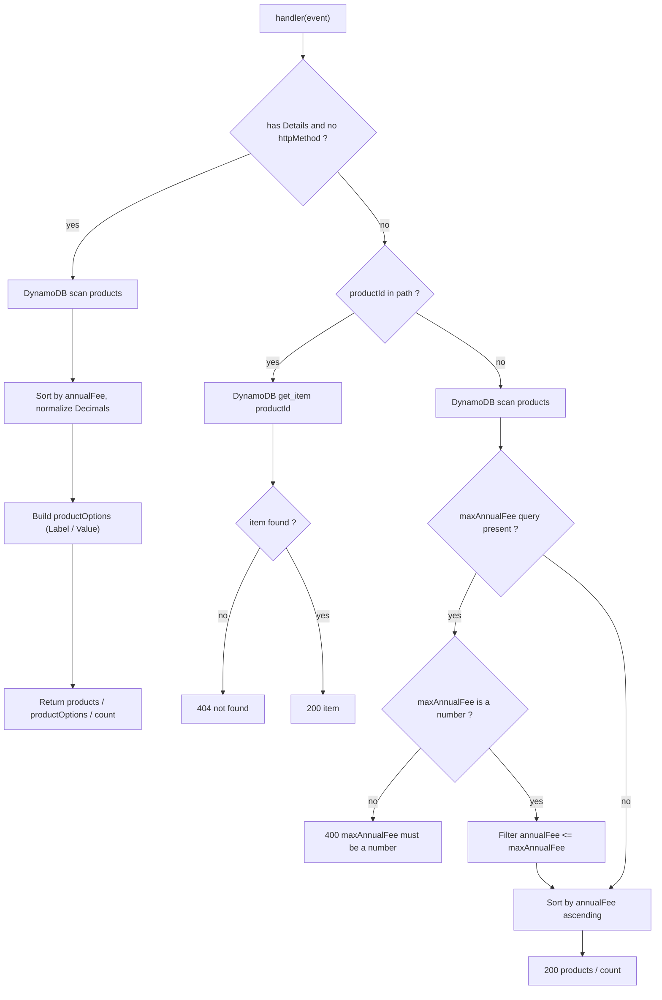
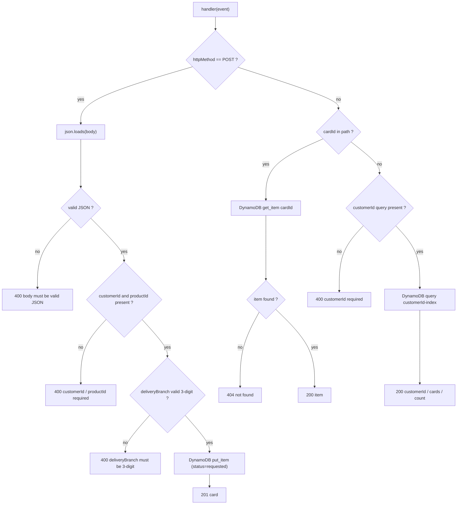
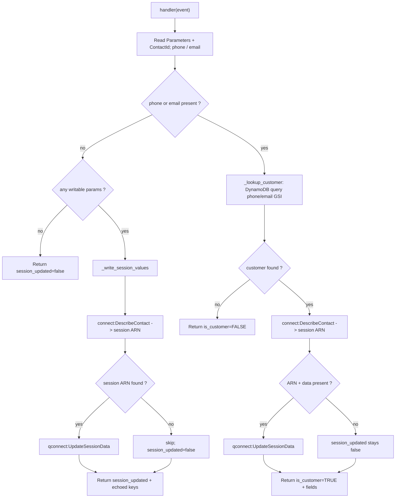
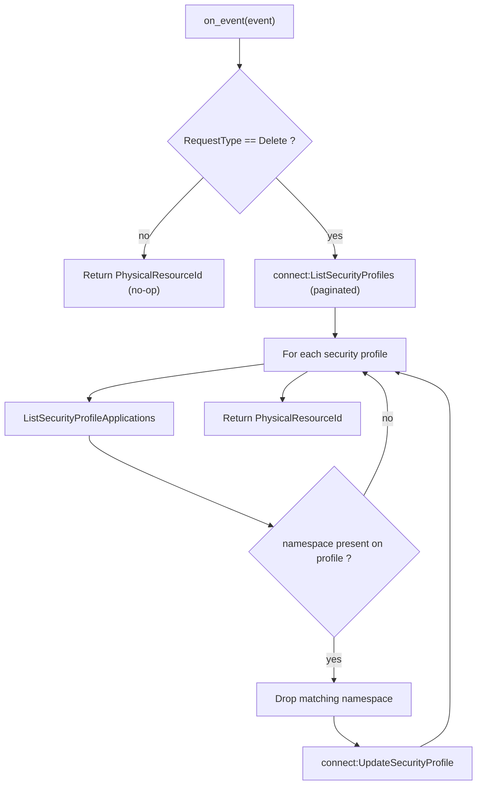
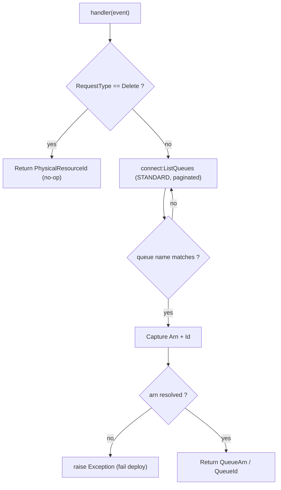
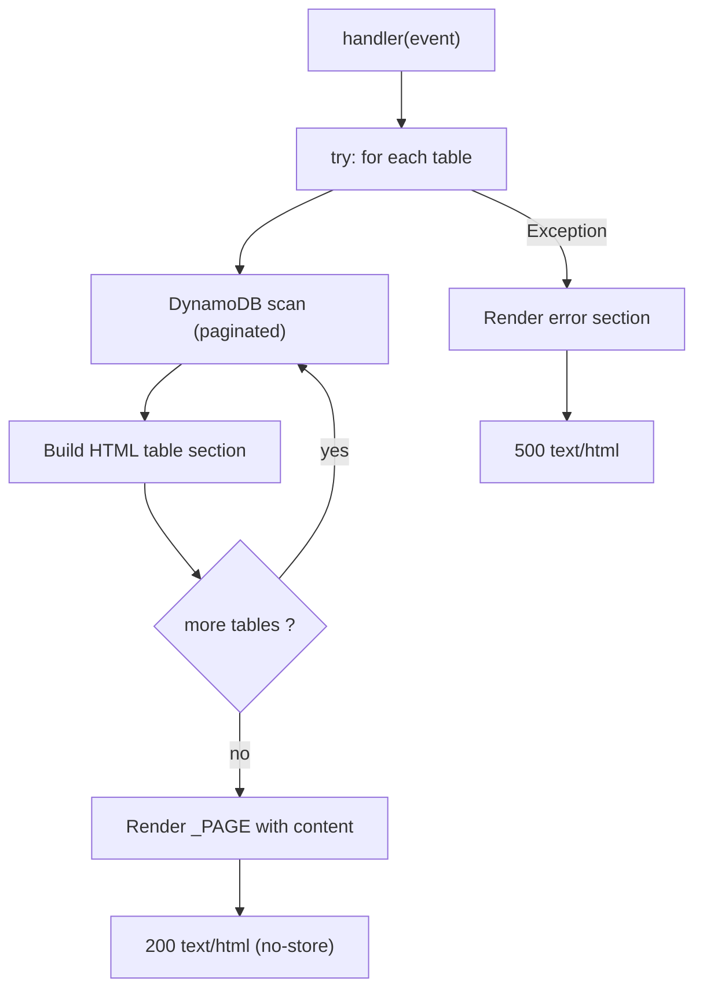

> 🌎 **English:** [if you want to see the English version, click here (`README-en.md`)](README-en.md)

# agentic-cx-airline

Un ejemplo por fases en AWS CDK (Python) que levanta un **backend de autoservicio de
banca retail** y lo expone a los **agentes de IA de Amazon Connect** como un servidor
MCP a través de un gateway de Bedrock AgentCore, más una **base de conocimiento de Q in
Connect** para recuperación (retrieval), los **recursos de soporte de Connect**
(perfiles de seguridad, vistas, guías, bot de Lex, flujos de contacto) que usan los
agentes, y un **sitio web estático "AeroLatam"** que aloja el widget de chat de
Connect. La app se divide en seis stacks pequeños y desacoplados que se despliegan de
forma independiente y se pasan valores entre sí solo a través de **SSM Parameter
Store** — sin exports de CloudFormation, sin nested stacks.

| Comando de despliegue | Stack | Fase | Qué despliega |
|---|---|---|---|
| `cdk deploy CX-AIRLINE-MCP` | `McpStack` | Fase 1 | Tablas DynamoDB + datos de ejemplo, el backend Lambda, la REST API `airline-api`, el gateway MCP de AgentCore, y las integraciones MCP/Lambda de Amazon Connect |
| `cdk deploy CX-AIRLINE-KB` | `KnowledgeBaseStack` | Fase 2 | La base de conocimiento EXTERNAL de Q in Connect respaldada en S3 (contenido es/pt/en) y su asociación con el asistente |
| `cdk deploy CX-AIRLINE-CONNECT-SUPPORT` | `ConnectSupportStack` | Fase 3 | Los perfiles de seguridad de los agentes de IA, las vistas administradas por el cliente, el flujo de la guía paso a paso de maleta perdida, y el bot Lex V2 de paso a Q-in-Connect |
| `cdk deploy CX-AIRLINE-AGENTS` | `AiAgentsStack` | Fase 4 | Los prompts de IA de orquestación y los tres agentes de IA (self-service voz + chat, agent-assist) |
| `cdk deploy CX-AIRLINE-FLOWS` | `ContactFlowsStack` | Fase 5 | La vista de traspaso de escalamiento, el flujo de screen-pop, los módulos de flujo escalate + set-customer-session, y el flujo inbound de self-service en español |
| `cdk deploy CX-AIRLINE-WEBSITE` | `WebsiteStack` | Fase 6 | El sitio estático "AeroLatam" (S3 privado + CloudFront OAC), el host del widget de chat de Connect, y el Lambda visor de datos de demo de DynamoDB |

**Orden de despliegue: `CX-AIRLINE-MCP` → `CX-AIRLINE-KB` → `CX-AIRLINE-CONNECT-SUPPORT` →
`CX-AIRLINE-AGENTS` → `CX-AIRLINE-FLOWS` → `CX-AIRLINE-WEBSITE`.** Las Fases 1 y 2 son
mutuamente independientes y pueden desplegarse en cualquier orden; cada fase posterior
consume valores de SSM publicados por las fases anteriores (ver [Despliegue](#despliegue)).

---

## Qué se despliega

**Cómputo (Lambda)** — `accounts`, `products`, `cards`, `ai_session` (backend de
banca), un custom resource de borrado `ProfileDetacher`, un custom resource de
despliegue `BasicQueueLookup`, y el `data_viewer` del sitio.

**Datos** — tres tablas DynamoDB on-demand (`airline-accounts`, `airline-products`,
`airline-cards`) sembradas en tiempo de despliegue, una API key en Secrets Manager, un
bucket S3 cifrado con KMS con los artículos de conocimiento, y un bucket S3 privado para
el build del sitio.

**APIs y gateways** — la REST API `airline-api` (API Gateway), un **gateway de Bedrock
AgentCore** (`airline-mcp-server`) que la re-expone como servidor MCP, y una distribución
de CloudFront (OAC) frente al sitio + visor de datos.

**Amazon Connect / Q in Connect** — una base de conocimiento EXTERNAL + asociación con
el asistente, dos perfiles de seguridad de agentes de IA, tres vistas administradas por
el cliente, un bot de paso QInConnect de Lex V2, tres agentes de IA (voz / chat /
agent-assist) con sus prompts de orquestación, y cinco flujos de contacto / módulos de
flujo.

En este proyecto **no hay tareas/servicios de ECS** ni **máquinas de estado de Step
Functions** — todo el cómputo es Lambda.



### Detalle por fase

**Fase 1 — `CX-AIRLINE-MCP`**
- **Tablas DynamoDB** para `airline-accounts`, `airline-products` y `airline-cards`
  (on-demand, sembradas con datos de ejemplo en tiempo de despliegue), con GSIs
  `phoneNumber-index` + `email-index` en accounts y `customerId-index` en cards.
- **Funciones Lambda**: `accounts`, `products`, `cards` y `ai_session`.
- **REST API** (`airline-api`, API Gateway) para las operaciones de banca, protegida por
  una API key almacenada en **Secrets Manager** y forzada con un usage plan.
- **Gateway de AgentCore** (`airline-mcp-server`, Bedrock) que re-expone la REST API como
  un **servidor MCP**, con un **proveedor de credenciales por API key**
  (`airline-mcp-server-apikey`) y un target OpenAPI inline
  (`airline-rest-api-oas-target`).
- **Integraciones de Amazon Connect**: registra el gateway como una **aplicación de
  servidor MCP** en la instancia de Connect (más un custom resource de borrado
  `ProfileDetacher`), y asocia los Lambdas `products` + `ai_session`
  (`LAMBDA_FUNCTION`).
- **Publica en SSM:** `GATEWAY_ID`, `MCP_TOOL_PREFIX`, `LAMBDA_PLANS_ARN` (el ARN del
  Lambda products — se preserva el sufijo de la clave), `LAMBDA_AI_SESSION_ARN`.

**Fase 2 — `CX-AIRLINE-KB`**
- **Clave KMS + bucket S3** con los artículos de conocimiento (subidos por CDK bajo
  `airline/<lang>/`).
- **DataIntegration de AppIntegrations** + **base de conocimiento EXTERNAL de Q in
  Connect** (`airline-kb`) que rastrea el bucket.
- **Asociación con el asistente** que vincula la KB al dominio de agentes de IA de Q in
  Connect para que la herramienta Retrieve de un agente pueda consultarla.
- **Publica en SSM:** `KB_ID`, `KB_ASSOC_ID`.

**Fase 3 — `CX-AIRLINE-CONNECT-SUPPORT`**
- **Perfiles de seguridad de los agentes de IA** (`airline-selfservice-ai-agent`,
  `airline-agent-assist-iac`): `Wisdom.View` + `CustomViews.Access` de mínimo privilegio,
  más la concesión de herramientas MCP construida en tiempo de despliegue a partir del
  id del gateway (consumido de SSM `GATEWAY_ID`).
- **Vistas administradas por el cliente** (`AWS::Connect::View`): el formulario guiado de
  solicitud de tarjeta de viajero (`AirlineCardRequestForm`) y la guía de maleta perdida
  (`AirlineLostBaggageGuide`).
- **Flujo de contacto de la guía de maleta perdida** (nombre visible **`Reportar maleta perdida`**). La asociación de contenido `AMAZON_CONNECT_GUIDE` que vincula el flujo con
  el contenido `maleta-perdida` de la KB se crea post-despliegue con
  `knowledge_bases/associate_guide.py` (los ids de contenido son valores
  posteriores a la ingesta), no por el stack.
- **Bot Lex V2 de paso a Q-in-Connect** (`airline-qconnect-bot-v2`): un único
  `AMAZON.QInConnectIntent` cableado al asistente de agentes de IA, 3 locales
  (en_US/es_US/pt_BR) sobre Nova Sonic v2 unified speech. El stack publica el ARN del
  **TestBotAlias** integrado del bot en SSM; compila los tres locales una vez en la
  consola después del despliegue.
- **Publica en SSM:** `SP_SELFSERVICE_ID`, `SP_ASSIST_ID`, `VIEW_NEWLINE_ARN` (el ARN
  calificado del formulario de solicitud de tarjeta — se preserva el sufijo de la
  clave), `LEX_BOT_ALIAS_ARN`.

**Fase 4 — `CX-AIRLINE-AGENTS`**
- **Prompts de IA de orquestación** (`AWS::Wisdom::AIPrompt`), uno por superficie de
  agente (`airline-selfservice-voice-orchestration`,
  `airline-selfservice-chat-orchestration`, `airline-agent-assist-orchestration`).
- **Tres agentes de IA** (`AWS::Wisdom::AIAgent`, orquestación):
  `airline-selfservice-voice-es` y `airline-selfservice-chat-es` (KB Retrieve + las 9
  herramientas MCP de AgentCore + Escalate/Complete; chat añade la herramienta de la guía
  de solicitud de tarjeta), y `airline-agent-assist-es` (Retrieve + solo superficie MCP).
  La herramienta Retrieve filtra `industry=airline` Y `language=es`. La asignación de
  perfiles de seguridad a los agentes es un paso **manual** post-despliegue.
- **Publica en SSM:** `AGENT_VOICE_ARN`, `AGENT_CHAT_ARN`, `AGENT_ASSIST_ARN`.

**Fase 5 — `CX-AIRLINE-FLOWS`**
- **Vista de traspaso de escalamiento** (`AirlineEscalationHandoff`, `AWS::Connect::View`)
  renderizada al aceptar el agente.
- **Flujo de contacto de screen-pop** (`airline-agent-screenpop-es`) que registra la vista
  de traspaso como el `DefaultAgentUI`.
- **Módulos de flujo**: `airline-escalate-to-agent` (define el hook de screen-pop + la cola
  destino, transfiere) y `set-customer-session-airline` (clasifica el endpoint, busca al
  cliente vía el Lambda `ai_session`, escribe la sesión de Q in Connect).
- **Flujo inbound de self-service** (`airline-selfservice-es-inbound`): el flujo de entrada
  de voz/chat en español que crea la sesión de Wisdom, vincula el bot Lex + los agentes
  de voz/chat/assist, conduce el formulario guiado de solicitud de tarjeta, y escala a un
  humano. También consume el `INIT_FLOW_MODULE_ARN` externo (`/flows/init/es`) como su
  módulo de inicio.
- **BasicQueueLookup** (custom resource `connect:ListQueues`) resuelve el ARN de la
  `BasicQueue` de la instancia por nombre en tiempo de despliegue.

**Fase 6 — `CX-AIRLINE-WEBSITE`**
- **Bucket S3 privado + CloudFront (OAC)** sirviendo el build de Vite del sitio
  "AeroLatam", que aloja el widget de chat de Amazon Connect y pasa el email logueado como
  atributo de contacto.
- **Lambda `data_viewer`** detrás de un comportamiento `/datos` de CloudFront que
  renderiza las tres tablas DynamoDB (`airline-accounts`, `airline-products`, `airline-cards`)
  como una página HTML de solo lectura.

---

## Subsistemas de banca

**Cuentas y búsqueda de cliente** — `airline-accounts` guarda las cuentas de cliente (con
GSIs `phoneNumber` y `email`). El Lambda `accounts` sirve la búsqueda de cuenta por
teléfono, por email, por id, y un resumen de saldo; el Lambda `ai_session` reutiliza las
mismas búsquedas para personalizar un contacto en vivo escribiendo el registro del
cliente en la sesión de Q in Connect.

**Catálogo de productos** — `airline-products` guarda el catálogo del programa de viajero
frecuente (membresía AeroLatam Club y tarjetas de viajero clásica/oro/platino). El Lambda `products` lista productos (con
un filtro opcional `maxAnnualFee`) y devuelve los detalles de un producto individual;
también responde llamadas de "Invoke Lambda" de Amazon Connect con una lista
`productOptions` lista para vista para el formulario guiado.

**Solicitudes de tarjeta** — `airline-cards` guarda las solicitudes de tarjeta / producto
indexadas por `cardId` (con un GSI `customerId-index`). El Lambda `cards` crea una nueva
solicitud (`status = requested`, `cardId` generado por el servidor), lista las
solicitudes de un cliente, y devuelve una solicitud individual por id. `requestCard` es
la única operación que cambia estado y está protegida por confirmación en los agentes.

**Base de conocimiento** — `airline-kb` sirve artículos de autoservicio (reservas,
viajero frecuente, check-in, equipaje, FAQ, info de aeropuertos, maleta perdida) en tres
idiomas (es/pt/en). La herramienta Retrieve de los agentes la consulta, segmentada por
etiquetas `industry` + `language`.

**Agentes de IA** — tres agentes de orquestación (self-service voz, self-service chat,
agent-assist) atienden contactos usando la herramienta KB Retrieve más las 9
herramientas MCP de banca, escalando a un humano cuando es necesario.

**Flujos de contacto** — el flujo inbound personaliza y enruta contactos, vincula el bot
Lex y los agentes, conduce el formulario de solicitud de tarjeta, y escala vía los
módulos de screen-pop + escalate.

**Sitio web** — el sitio "AeroLatam" aloja el widget de chat de Connect y un visor de
datos de demo para las tres tablas DynamoDB.

---

## Flujos de código de los Lambda

Cada Lambda desplegado es Python 3.12 en ARM64. Las cuatro funciones del backend de
banca (`accounts`, `products`, `cards`, `ai_session`) comparten un helper `_response()` /
`_json_default` que serializa los valores `Decimal` de DynamoDB a números JSON nativos.
**Ningún handler escribe en `/tmp` ni en S3** — la persistencia es solo DynamoDB, datos
de sesión de Q in Connect, o el estado de perfiles de seguridad de Connect.

### accounts

**Disparador:** API Gateway REST (proxy). Rutas: `GET /accounts?phoneNumber=`,
`GET /accounts/by-email?email=`, `GET /accounts/{accountId}`,
`GET /accounts/{accountId}/balance`. Lee la tabla `airline-accounts`
(+ GSIs de phone/email).



### products

**Disparador:** DUAL. (a) Proxy REST de API Gateway: `GET /products?maxAnnualFee=`,
`GET /products/{productId}`. (b) **Invoke AWS Lambda function** de Amazon Connect
(detectado cuando el evento tiene una clave `Details` de nivel superior y no tiene
`httpMethod`). Lee la tabla `airline-products`.



### cards

**Disparador:** Proxy REST de API Gateway. Rutas: `POST /cards`, `GET /cards?customerId=`,
`GET /cards/{cardId}`. Lee/escribe la tabla `airline-cards` (+ GSI de customerId); genera
`cardId` del lado del servidor con `uuid4`.



### ai_session

**Disparador:** `InvokeLambdaFunction` de Amazon Connect desde el módulo de flujo
`set-customer-session-airline`. Devuelve un **STRING_MAP** plano. Lee la tabla
`airline-accounts` (GSIs de phone/email), llama a `connect:DescribeContact` para encontrar
el ARN de la sesión de Wisdom del contacto, y a `qconnect:UpdateSessionData` para
escribir atributos en la sesión de Q in Connect. Todas las fallas de Connect/sesión se
silencian para que una escritura de personalización nunca bloquee el contacto.



### ProfileDetacher (custom resource, en borrado)

**Disparador:** custom resource de CloudFormation (`cr.Provider`) en el stack de MCP. En
**Create/Update es un no-op**; en **Delete** quita el namespace de esta aplicación MCP
(el id del gateway) de cada perfil de seguridad de Connect que aún lo conceda, para que
`DeleteIntegrationAssociation` pueda proceder automáticamente. Llama a
`connect:ListSecurityProfiles`, `ListSecurityProfileApplications`, y
`UpdateSecurityProfile`.



### BasicQueueLookup (custom resource, en despliegue)

**Disparador:** custom resource de CloudFormation en el stack de FLOWS. Resuelve el ARN
de la cola estándar por nombre (`connect:ListQueues`, paginado) para que los flujos
transfieran a una cola válida sin id hardcodeado. Lanza un error ruidoso si la cola
nombrada no se encuentra.



### data_viewer (sitio web)

**Disparador:** Lambda detrás de un comportamiento `/datos` de CloudFront (proxy de API
Gateway con OAC). Escanea las tres tablas DynamoDB (`airline-accounts`, `airline-products`,
`airline-cards`) con paginación completa y renderiza una única página HTML de solo lectura
en memoria (sin `/tmp`, sin S3). Un único try/except devuelve una página HTML 500 ante
cualquier error.



## Flujos de código de tareas y servicios de ECS

Ninguno. Este proyecto no despliega tareas ni servicios de ECS.

## Workflows de Step Functions

Ninguno. Este proyecto no despliega máquinas de estado de Step Functions.

---

## Estructura del proyecto

```
agentic-cx-airline/
├── app.py                     # Entrada de la app CDK — cablea los seis stacks por fases + dependencias
├── config.py                  # Config plana a nivel de módulo, agrupada por fase de despliegue (sin secretos)
├── cdk.json                   # Ejecuta `python3 app.py`
├── requirements.txt           # Deps de runtime (aws-cdk-lib, constructs) + `-e ../cdk_constructs` (constructs compartidos)
├── requirements-dev.txt       # Deps de dev (pytest)
│
├── agentic_cx_airline/           # Los seis stacks CDK
│   ├── mcp_stack.py               # Fase 1  CX-AIRLINE-MCP
│   ├── knowledge_base_stack.py    # Fase 2  CX-AIRLINE-KB
│   ├── connect_support_stack.py   # Fase 3  CX-AIRLINE-CONNECT-SUPPORT
│   ├── ai_agents_stack.py         # Fase 4  CX-AIRLINE-AGENTS
│   ├── contact_flows_stack.py     # Fase 5  CX-AIRLINE-FLOWS
│   └── website_stack.py           # Fase 6  CX-AIRLINE-WEBSITE
│
├── lambdas/
│   ├── project_lambdas.py     # Construct `Lambdas` (accounts / products / cards / ai_session)
│   └── code/                  # Código de los handlers, una carpeta por función
│       ├── accounts/handler.py
│       ├── products/handler.py
│       ├── cards/handler.py
│       ├── ai_session/handler.py
│       └── data_viewer/index.py   # handler del visor de datos /datos (branding por industria)
│
├── apis/                      # Datos de industria: openapi/openapi.yaml + airline_api.py (mapa de rutas REST)
├── databases/                # Construct `Tables` (schema por industria) + datos semilla (data/)
├── knowledge_bases/          # Contenido de la KB (artículos de aerolínea) + scripts post-despliegue
│   ├── tag_kb_content.py                  # post-despliegue: etiqueta el contenido de la KB para segmentación de Retrieve
│   └── associate_guide.py   # post-despliegue: crea la asociación AMAZON_CONNECT_GUIDE
├── connect/                  # Datos de industria de Connect
│   └── agent_tools.py             # `AgentToolset`: catálogo de tools MCP, instrucciones, guía de chat
├── connect_ai_agents/        # YAML de prompts de orquestación por superficie de agente
│   ├── airline-selfservice-voice/prompts/*.yaml
│   ├── airline-selfservice-chat/prompts/*.yaml
│   └── airline-agent-assist-es/prompts/*.yaml
├── flows/                    # JSON de flujos de contacto + módulos (una carpeta por flujo)
├── views/                    # JSON de vistas administradas por el cliente (formulario solicitud tarjeta / guía maleta perdida / traspaso)
├── website/                  # Front-end Vite "AeroLatam" (salida del build → website/dist)
├── shared/ssm_names.py       # El contrato de nombres de parámetros SSM entre stacks
└── tests/unit/               # Andamiaje de pytest
```

## Pruebas

La dependencia de dev es `pytest` (`requirements-dev.txt`). Ejecuta la suite desde la
raíz del proyecto dentro del virtualenv:

```bash
source .venv/bin/activate
pip install -r requirements-dev.txt
pytest tests/unit/
```

El enfoque previsto son **pruebas de aserción** de CDK — sintetizar un stack a una
plantilla de CloudFormation y hacer aserciones sobre las propiedades de los recursos —
que combina bien con el flujo de trabajo "synth es la puerta de verificación"
(`cdk synth` debe pasar antes de desplegar).

## Configuración

Toda la configuración son constantes planas a nivel de módulo en `config.py` (sin
secretos; las credenciales de AWS se resuelven desde tu perfil/SSO local en tiempo de
despliegue), ordenadas por la fase de despliegue que primero consume cada valor. Grupos
clave: identidad de Connect (`INSTANCE_ID`, `INSTANCE_ALIAS`, `ASSISTANT_ID`,
`HAS_REAL_INSTANCE`), nombres, ajustes de KB, perfiles de seguridad, vistas/guía, bot de
Lex, agentes de IA/prompts/modelos, flujos de contacto, y ajustes de build del sitio.
Cada nombre de recurso lleva el prefijo de su industria, así que nunca colisiona con los
recursos de un proyecto hermano en la instancia de Connect compartida. Ver `config.py`
para la lista completa anotada.

### Parámetros SSM (el contrato entre stacks)

Definidos una sola vez en `shared/ssm_names.py` bajo el namespace `/agentic-cx-airline`.
Solo se publican los valores que genuinamente cruzan un límite de stack; todo lo demás
queda como un `CfnOutput`. Los secretos nunca van en el bus (la API key se queda en
Secrets Manager).

| Parámetro | Productor | Consumido por | Valor que lleva |
|---|---|---|---|
| `/agentic-cx-airline/agentcore/gateway-id` | `CX-AIRLINE-MCP` | Fase 3 | id del gateway sin adornos (namespace MCP del perfil de seguridad + audiencia JWT de Connect) |
| `/agentic-cx-airline/agentcore/mcp-tool-prefix` | `CX-AIRLINE-MCP` | Fase 4 | prefijo `gateway_<id>__airline-rest-api-oas-target___` para los ids de herramientas MCP del agente |
| `/agentic-cx-airline/agentcore/lambda/plans-arn` | `CX-AIRLINE-MCP` | Fase 5 | ARN del Lambda products (para los flujos de contacto) |
| `/agentic-cx-airline/agentcore/lambda/ai-session-arn` | `CX-AIRLINE-MCP` | Fase 5 | ARN del Lambda ai_session (para los flujos de contacto) |
| `/agentic-cx-airline/kb/knowledge-base-id` | `CX-AIRLINE-KB` | scripts | id de la KB (leído por ambos scripts post-despliegue) |
| `/agentic-cx-airline/kb/assistant-association-id` | `CX-AIRLINE-KB` | Fase 4 | id de la asociación KB↔asistente (binding Retrieve del agente) |
| `/agentic-cx-airline/connect/security-profile-selfservice-id` | `CX-AIRLINE-CONNECT-SUPPORT` | manual | id del perfil de seguridad del agente de IA self-service |
| `/agentic-cx-airline/connect/security-profile-assist-id` | `CX-AIRLINE-CONNECT-SUPPORT` | manual | id del perfil de seguridad de agent-assist |
| `/agentic-cx-airline/connect/view-newline-qualified-arn` | `CX-AIRLINE-CONNECT-SUPPORT` | Fase 5 | ARN de la vista del formulario de solicitud de tarjeta (ShowView del flujo inbound) |
| `/agentic-cx-airline/connect/lex-bot-alias-arn` | `CX-AIRLINE-CONNECT-SUPPORT` | Fase 5 | ARN del TestBotAlias del bot Lex para los bloques Lex del flujo inbound |
| `/agentic-cx-airline/agents/voice-arn` | `CX-AIRLINE-AGENTS` | Fase 5 | ARN del agente de IA de voz self-service |
| `/agentic-cx-airline/agents/chat-arn` | `CX-AIRLINE-AGENTS` | Fase 5 | ARN del agente de IA de chat self-service |
| `/agentic-cx-airline/agents/assist-arn` | `CX-AIRLINE-AGENTS` | Fase 5 | ARN del agente de IA agent-assist |

> **Dependencia externa (no es una clave del Airline_Project):** `INIT_FLOW_MODULE_ARN`
> resuelve a `/flows/init/es`, que vive **fuera** del namespace `/agentic-cx-airline`. Lo
> publica la app de localización separada `CX-LANG-UTILS` en la misma instancia de
> Connect y lo consume el flujo inbound de la Fase 5 como su módulo de inicio.
> `CX-LANG-UTILS` debe desplegarse primero para que el parámetro exista en tiempo de
> despliegue.

---

## Despliegue

```bash
source .venv/bin/activate
pip install -r requirements.txt

# synth (puerta de verificación) — cdk.json ejecuta `python3 app.py`
cdk synth

# Fase 1 + Fase 2 — independientes, se despliegan en cualquier orden
cdk deploy CX-AIRLINE-MCP --profile connect-industry
cdk deploy CX-AIRLINE-KB  --profile connect-industry

# Fase 3 — depende de la Fase 1 (gateway id) y de la Fase 2 (kb id)
cdk deploy CX-AIRLINE-CONNECT-SUPPORT --profile connect-industry

# Fase 4 — depende de la Fase 1 (prefijo de herramientas MCP) y de la Fase 2 (asociación de KB)
cdk deploy CX-AIRLINE-AGENTS --profile connect-industry

# Fase 5 — depende de la Fase 1 (Lambda ai_session), la Fase 3 (vista + alias Lex),
# y la Fase 4 (ARNs de agentes)
cdk deploy CX-AIRLINE-FLOWS --profile connect-industry

# Fase 6 — compila el sitio primero, luego despliega (S3 + CloudFront)
cd website && npm install && npm run build && cd ..
cdk deploy CX-AIRLINE-WEBSITE --profile connect-industry
```

Orden de despliegue: **`CX-AIRLINE-MCP` → `CX-AIRLINE-KB` → `CX-AIRLINE-CONNECT-SUPPORT` →
`CX-AIRLINE-AGENTS` → `CX-AIRLINE-FLOWS` → `CX-AIRLINE-WEBSITE`.**

### Pasos post-despliegue

Después de que la **Fase 2** termine su primer sync, etiqueta el contenido de la KB para
que la herramienta Retrieve lo encuentre, luego cablea la guía de maleta perdida a su
artículo. Ambos scripts resuelven el KB id desde SSM `KB_ID` (o `--kb-id`), así que no
hace falta copiar ningún id a mano:

```bash
# 1. Etiqueta cada ítem de contenido de la KB (industry: airline + una etiqueta de idioma es/pt/en por ítem).
#    --wait sondea hasta que 21 ítems estén ACTIVE, luego los etiqueta.
python knowledge_bases/tag_kb_content.py --wait --expect 21 --profile connect-industry

# 2. Vincula el flujo de la guía "Reportar maleta perdida" con el contenido maleta-perdida de la KB
#    (asociación AMAZON_CONNECT_GUIDE idempotente). Añade --dry-run para previsualizar.
python knowledge_bases/associate_guide.py --profile connect-industry
python knowledge_bases/associate_guide.py --dry-run --profile connect-industry
```

Después de la **Fase 4**, asigna los perfiles de seguridad de la Fase 3 a los agentes de
IA (manual — no hay recurso nativo de CFN para `connect:AssociateSecurityProfiles` con
`EntityType=AI_AGENT`):

1. En el **sitio de administración de Amazon Connect**, abre **AI agents** (Q in Connect).
2. Asigna perfiles: voz + chat → `airline-selfservice-ai-agent`, agent-assist →
   `airline-agent-assist-iac` (usa los valores `SP_SELFSERVICE_ID` / `SP_ASSIST_ID`
   publicados en SSM para identificarlos).
3. Para **agent-assist**, los agentes humanos que usan el panel del asistente también
   deben llevar los mismos permisos — las llamadas a herramientas se autorizan contra la
   intersección de los perfiles del agente de IA y del agente humano.

Después de la **Fase 3**, compila los tres locales del bot Lex (`en_US`, `es_US`,
`pt_BR`) en la consola de Amazon Lex V2 para que su **TestBotAlias** quede activo para el
flujo inbound (los locales intencionalmente no se auto-compilan para mantener el
despliegue rápido).

> La habilitación de los locales en el TestBotAlias la maneja automáticamente un custom
> resource en `CX-AIRLINE-CONNECT-SUPPORT`, así que el chat funciona sin la alternancia
> manual de locales del alias. Aun así necesitas **compilar** los tres locales en la
> consola de Lex.
