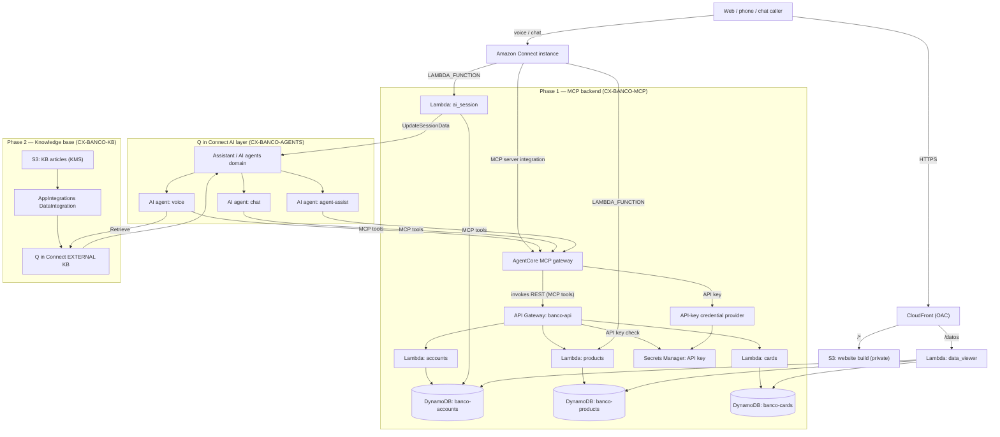
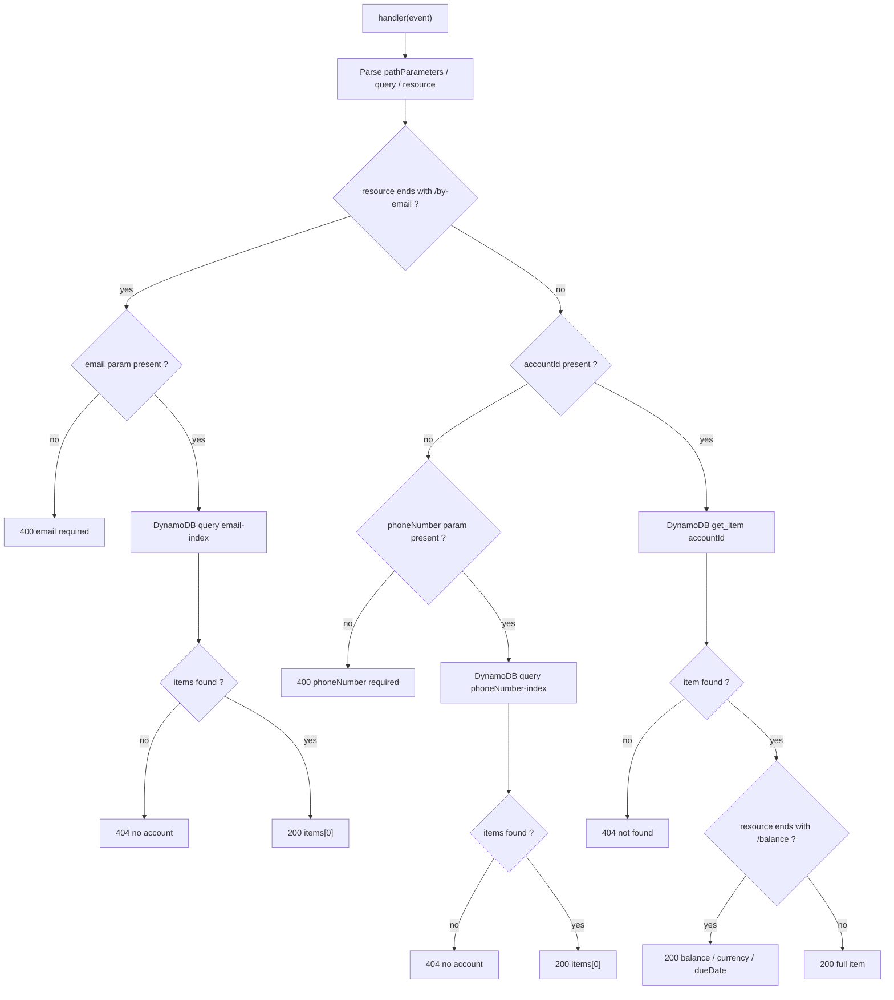
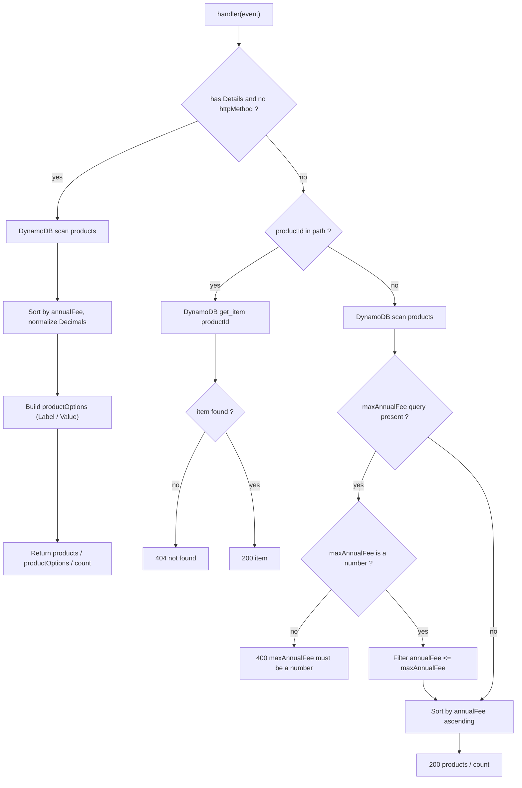
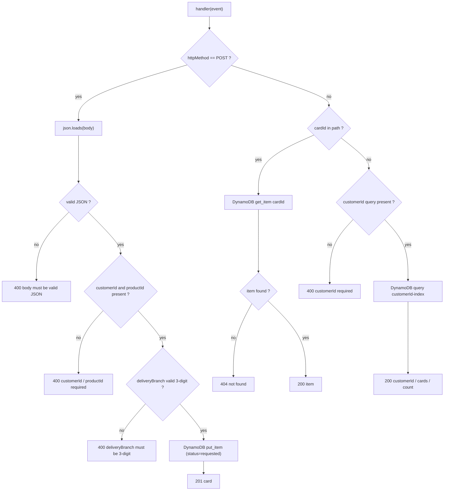
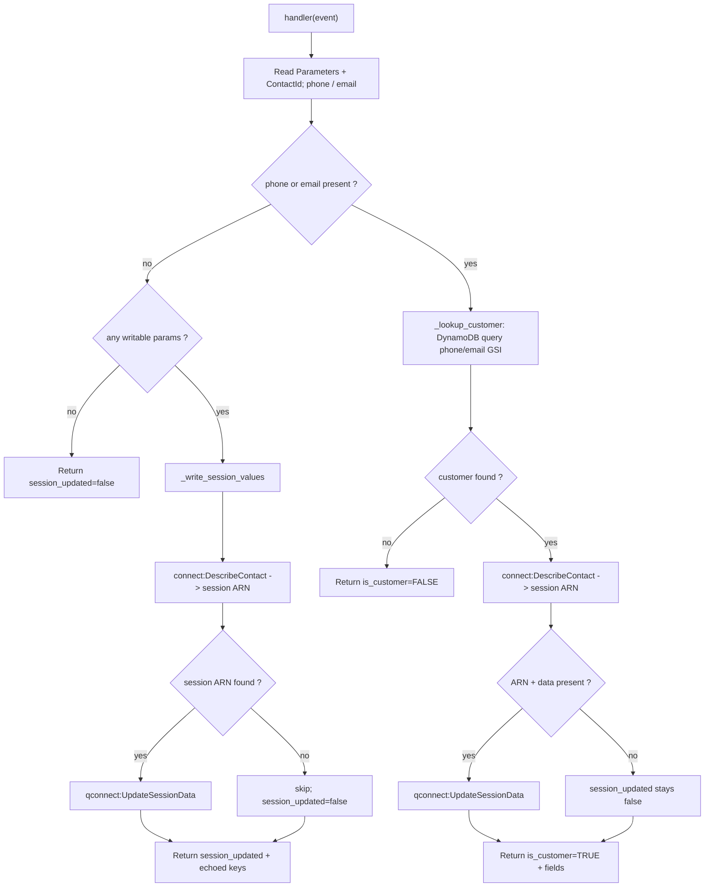
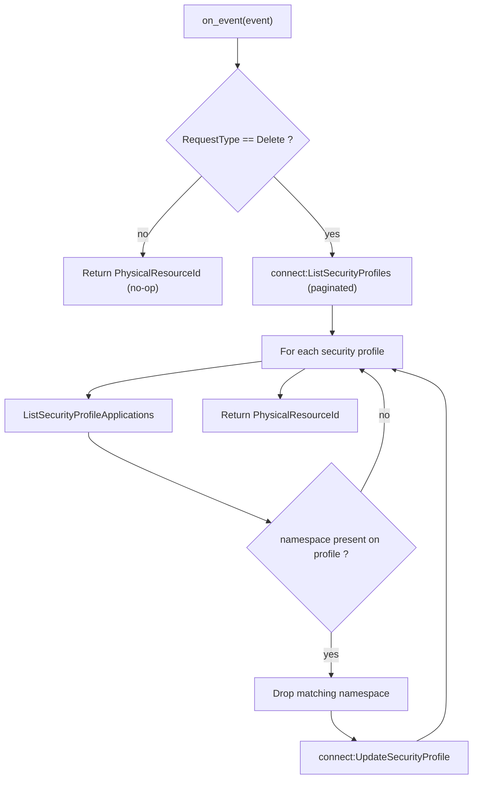
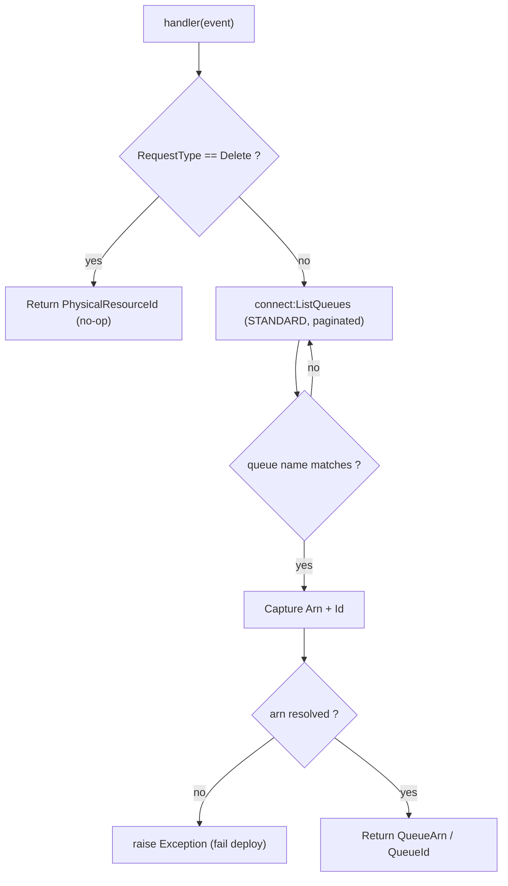
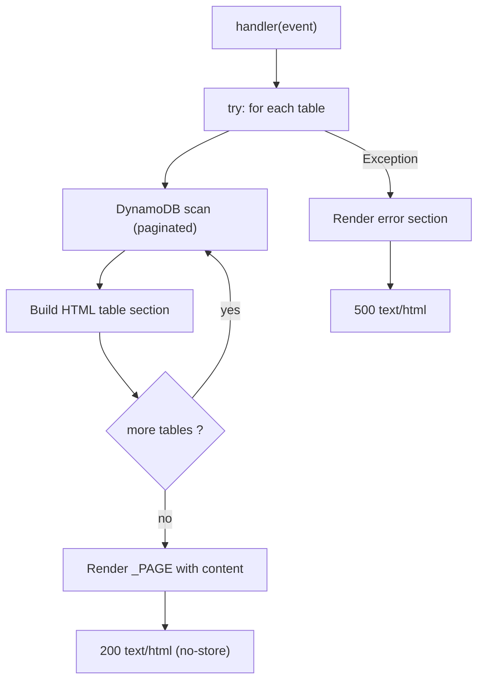

> 🌎 **Español:** [ver la versión en español (`README.md`)](README.md)

# agentic-cx-bank

A phased AWS CDK (Python) sample that stands up a **retail-banking self-service
backend** and exposes it to **Amazon Connect AI agents** as an MCP server through
a Bedrock AgentCore gateway, plus a **Q in Connect knowledge base** for retrieval,
the **Connect supporting resources** (security profiles, views, guides, Lex bot,
contact flows) the agents use, and a static **"Latam Banco" website** that hosts
the Connect chat widget. The app is split into six small, decoupled stacks that
deploy independently and pass values to each other only through **SSM Parameter
Store** — no CloudFormation exports, no nested stacks.

| Deploy command | Stack | Phase | What it deploys |
|---|---|---|---|
| `cdk deploy CX-BANCO-MCP` | `McpStack` | Phase 1 | DynamoDB tables + sample data, the Lambda backend, the `banco-api` REST API, the AgentCore MCP gateway, and the Amazon Connect MCP/Lambda integrations |
| `cdk deploy CX-BANCO-KB` | `KnowledgeBaseStack` | Phase 2 | The S3-backed EXTERNAL Q in Connect knowledge base (es/pt/en content) and its assistant association |
| `cdk deploy CX-BANCO-CONNECT-SUPPORT` | `ConnectSupportStack` | Phase 3 | The AI-agent security profiles, the customer-managed views, the activate-card step-by-step guide flow, and the Lex V2 Q-in-Connect passthrough bot |
| `cdk deploy CX-BANCO-AGENTS` | `AiAgentsStack` | Phase 4 | The orchestration AI prompts and the three AI agents (self-service voice + chat, agent-assist) |
| `cdk deploy CX-BANCO-FLOWS` | `ContactFlowsStack` | Phase 5 | The escalation handoff view, screen-pop flow, the escalate + set-customer-session flow modules, and the Spanish self-service inbound flow |
| `cdk deploy CX-BANCO-WEBSITE` | `WebsiteStack` | Phase 6 | The static "Latam Banco" site (private S3 + CloudFront OAC), the Connect chat widget host, and the demo DynamoDB data-viewer Lambda |

**Deploy order: `CX-BANCO-MCP` → `CX-BANCO-KB` → `CX-BANCO-CONNECT-SUPPORT` →
`CX-BANCO-AGENTS` → `CX-BANCO-FLOWS` → `CX-BANCO-WEBSITE`.** Phases 1 and 2 are
mutually independent and may deploy in any order; every later phase consumes SSM
values published by the phases before it (see [Deploy](#deploy)).

---

## What Is Deployed

**Compute (Lambda)** — `accounts`, `products`, `cards`, `ai_session` (banking
backend), a `ProfileDetacher` delete-time custom resource, a `BasicQueueLookup`
deploy-time custom resource, and the website `data_viewer`.

**Data** — three on-demand DynamoDB tables (`banco-accounts`, `banco-products`,
`banco-cards`) seeded at deploy time, an API key in Secrets Manager, a
KMS-encrypted S3 bucket of knowledge articles, and a private S3 bucket for the
website build.

**APIs & gateways** — the `banco-api` REST API (API Gateway), a Bedrock
**AgentCore gateway** (`banco-mcp-server`) re-exposing it as an MCP server, and a
CloudFront distribution (OAC) in front of the website + data viewer.

**Amazon Connect / Q in Connect** — an EXTERNAL knowledge base + assistant
association, two AI-agent security profiles, three customer-managed views, a Lex V2
QInConnect passthrough bot, three AI agents (voice / chat / agent-assist) with their
orchestration prompts, and five contact flows / flow modules.

There are **no ECS tasks/services** and **no Step Functions state machines** in this
project — all compute is Lambda.



### Phase detail

**Phase 1 — `CX-BANCO-MCP`**
- **DynamoDB tables** for `banco-accounts`, `banco-products`, and `banco-cards`
  (on-demand, seeded with sample data at deploy time), with GSIs
  `phoneNumber-index` + `email-index` on accounts and `customerId-index` on cards.
- **Lambda functions**: `accounts`, `products`, `cards`, and `ai_session`.
- **REST API** (`banco-api`, API Gateway) for banking operations, protected by an
  API key stored in **Secrets Manager** and enforced with a usage plan.
- **AgentCore Gateway** (`banco-mcp-server`, Bedrock) that re-exposes the REST API
  as an **MCP server**, with an **API-key credential provider**
  (`banco-mcp-server-apikey`) and an inline OpenAPI target
  (`banco-rest-api-oas-target`).
- **Amazon Connect integrations**: registers the gateway as an **MCP server
  application** on the Connect instance (plus a delete-time `ProfileDetacher`
  custom resource), and associates the `products` + `ai_session` Lambdas
  (`LAMBDA_FUNCTION`).
- **Publishes to SSM:** `GATEWAY_ID`, `MCP_TOOL_PREFIX`, `LAMBDA_PLANS_ARN` (the
  products Lambda ARN — key suffix preserved), `LAMBDA_AI_SESSION_ARN`.

**Phase 2 — `CX-BANCO-KB`**
- **KMS key + S3 bucket** holding the knowledge articles (uploaded by CDK under
  `bank/<lang>/`).
- **AppIntegrations DataIntegration** + **EXTERNAL Q in Connect knowledge base**
  (`banco-kb`) that crawls the bucket.
- **Assistant association** binding the KB to the Q in Connect AI Agents domain so
  an agent's Retrieve tool can query it.
- **Publishes to SSM:** `KB_ID`, `KB_ASSOC_ID`.

**Phase 3 — `CX-BANCO-CONNECT-SUPPORT`**
- **AI-agent security profiles** (`banco-selfservice-ai-agent`,
  `banco-agent-assist-iac`): least-privilege `Wisdom.View` + `CustomViews.Access`,
  plus the MCP tool grant built at deploy time from the gateway id (consumed from
  SSM `GATEWAY_ID`).
- **Customer-managed views** (`AWS::Connect::View`): the card-request guided form
  (`BancoCardRequestForm`) and the activate-card guide (`BancoCardActivationGuide`).
- **Activate-card guide contact flow** (display name **`Activar tarjeta`**). The
  `AMAZON_CONNECT_GUIDE` content association that binds the flow to the
  `activar-tarjeta` KB content is created post-deploy by
  `knowledge_bases/associate_activate_card_guide.py` (the content ids are
  post-ingestion values), not by the stack.
- **Lex V2 Q-in-Connect passthrough bot** (`banco-qconnect-bot-v2`): a single
  `AMAZON.QInConnectIntent` wired to the AI Agents assistant, 3 locales
  (en_US/es_US/pt_BR) on Nova Sonic v2 unified speech. The stack publishes the
  bot's built-in **TestBotAlias** ARN to SSM; build the three locales once in the
  console after deploy.
- **Publishes to SSM:** `SP_SELFSERVICE_ID`, `SP_ASSIST_ID`, `VIEW_NEWLINE_ARN`
  (the card-request form's qualified ARN — key suffix preserved),
  `LEX_BOT_ALIAS_ARN`.

**Phase 4 — `CX-BANCO-AGENTS`**
- **Orchestration AI prompts** (`AWS::Wisdom::AIPrompt`), one per agent surface
  (`banco-selfservice-voice-orchestration`, `banco-selfservice-chat-orchestration`,
  `banco-agent-assist-orchestration`).
- **Three AI agents** (`AWS::Wisdom::AIAgent`, orchestration):
  `banco-selfservice-voice-es` and `banco-selfservice-chat-es` (KB Retrieve + the 9
  AgentCore MCP tools + Escalate/Complete; chat adds the card-request guide tool),
  and `banco-agent-assist-es` (Retrieve + MCP surface only). The Retrieve tool
  filters `industry=bank` AND `language=es`. Security-profile assignment to the
  agents is a **manual** post-deploy step.
- **Publishes to SSM:** `AGENT_VOICE_ARN`, `AGENT_CHAT_ARN`, `AGENT_ASSIST_ARN`.

**Phase 5 — `CX-BANCO-FLOWS`**
- **Escalation handoff view** (`BancoEscalationHandoff`, `AWS::Connect::View`)
  rendered on agent accept.
- **Screen-pop contact flow** (`banco-agent-screenpop-es`) that registers the
  handoff view as the `DefaultAgentUI`.
- **Flow modules**: `banco-escalate-to-agent` (sets the screen-pop hook + target
  queue, transfers) and `set-customer-session-banco` (classifies the endpoint,
  looks the customer up via the `ai_session` Lambda, writes the Q in Connect
  session).
- **Inbound self-service flow** (`banco-selfservice-es-inbound`): the Spanish
  voice/chat entry flow that creates the Wisdom session, binds the Lex bot + the
  voice/chat/assist agents, drives the card-request guided form, and escalates to a
  human. It also consumes the external `INIT_FLOW_MODULE_ARN` (`/flows/init/es`) as
  its start module.
- **BasicQueueLookup** (`connect:ListQueues` custom resource) resolves the
  instance's `BasicQueue` ARN by name at deploy time.

**Phase 6 — `CX-BANCO-WEBSITE`**
- **Private S3 bucket + CloudFront (OAC)** serving the Vite build of the "Latam
  Banco" site, which hosts the Amazon Connect chat widget and passes the logged-in
  email as a contact attribute.
- **`data_viewer` Lambda** behind a CloudFront `/datos` behavior that renders the
  three DynamoDB tables (`banco-accounts`, `banco-products`, `banco-cards`) as a
  read-only HTML page.

---

## Banking subsystems

**Accounts & customer lookup** — `banco-accounts` holds customer accounts (with
`phoneNumber` and `email` GSIs). The `accounts` Lambda serves account lookup by
phone, by email, by id, and a balance summary; the `ai_session` Lambda reuses the
same lookups to personalize a live contact by writing the customer record into the
Q in Connect session.

**Product catalog** — `banco-products` holds the banking product catalog (payroll
accounts, classic/gold cards, …). The `products` Lambda lists products (with an
optional `maxAnnualFee` filter) and returns a single product's details; it also
answers Amazon Connect "Invoke Lambda" calls with a view-ready `productOptions`
list for the guided form.

**Card requests** — `banco-cards` holds card / product requests keyed by `cardId`
(with a `customerId-index` GSI). The `cards` Lambda creates a new request
(`status = requested`, server-generated `cardId`), lists a customer's requests, and
returns a single request by id. `requestCard` is the one state-changing operation
and is confirmation-gated in the agents.

**Knowledge base** — `banco-kb` serves self-service articles (accounts, cards,
transfers, fees, FAQ, branch info, activate-card) in three languages (es/pt/en).
The agents' Retrieve tool queries it, segmented by `industry` + `language` tags.

**AI agents** — three orchestration agents (self-service voice, self-service chat,
agent-assist) answer contacts using the KB Retrieve tool plus the 9 banking MCP
tools, escalating to a human when needed.

**Contact flows** — the inbound flow personalizes and routes contacts, binds the
Lex bot and the agents, drives the card-request form, and escalates via the
screen-pop + escalate modules.

**Website** — the "Latam Banco" site hosts the Connect chat widget and a demo
data-viewer for the three DynamoDB tables.

---

## Lambda Code Flows

Every deployed Lambda is Python 3.12 on ARM64. The four banking-backend functions
(`accounts`, `products`, `cards`, `ai_session`) share a `_response()` /
`_json_default` helper that serializes DynamoDB `Decimal` values to native JSON
numbers. **No handler writes to `/tmp` or S3** — persistence is DynamoDB, Q in
Connect session data, or Connect security-profile state only.

### accounts

**Trigger:** API Gateway REST (proxy). Routes: `GET /accounts?phoneNumber=`,
`GET /accounts/by-email?email=`, `GET /accounts/{accountId}`,
`GET /accounts/{accountId}/balance`. Reads the `banco-accounts` table
(+ phone/email GSIs).



### products

**Trigger:** DUAL. (a) API Gateway REST proxy: `GET /products?maxAnnualFee=`,
`GET /products/{productId}`. (b) Amazon Connect **Invoke AWS Lambda function**
(detected when the event has a top-level `Details` key and no `httpMethod`). Reads
the `banco-products` table.



### cards

**Trigger:** API Gateway REST proxy. Routes: `POST /cards`, `GET /cards?customerId=`,
`GET /cards/{cardId}`. Reads/writes the `banco-cards` table (+ customerId GSI);
generates `cardId` server-side with `uuid4`.



### ai_session

**Trigger:** Amazon Connect `InvokeLambdaFunction` from the
`set-customer-session-banco` flow module. Returns a flat **STRING_MAP**. Reads the
`banco-accounts` table (phone/email GSIs), calls `connect:DescribeContact` to find
the contact's Wisdom session ARN, and `qconnect:UpdateSessionData` to write
attributes into the Q in Connect session. All Connect/session failures are swallowed
so a personalization write never blocks the contact.



### ProfileDetacher (custom resource, delete-time)

**Trigger:** CloudFormation custom resource (`cr.Provider`) in the MCP stack. On
**Create/Update it is a no-op**; on **Delete** it strips this MCP application's
namespace (the gateway id) from every Connect security profile that still grants it,
so `DeleteIntegrationAssociation` can proceed automatically. Calls
`connect:ListSecurityProfiles`, `ListSecurityProfileApplications`, and
`UpdateSecurityProfile`.



### BasicQueueLookup (custom resource, deploy-time)

**Trigger:** CloudFormation custom resource in the FLOWS stack. Resolves the standard
queue ARN by name (`connect:ListQueues`, paginated) so the flows transfer to a valid
queue with no hard-coded id. Raises loudly if the named queue is not found.



### data_viewer (website)

**Trigger:** Lambda behind a CloudFront `/datos` behavior (API Gateway proxy with
OAC). Scans all three DynamoDB tables (`banco-accounts`, `banco-products`,
`banco-cards`) with full pagination and renders a single read-only HTML page in
memory (no `/tmp`, no S3). A single try/except returns a 500 HTML page on any error.



## ECS Task and Service Code Flows

None. This project deploys no ECS tasks or services.

## Step Functions Workflows

None. This project deploys no Step Functions state machines.

---

## Project Structure

```
agentic-cx-bank/
├── app.py                     # CDK app entry — wires the six phased stacks + dependencies
├── config.py                  # Flat module-level config, grouped by deploy phase (no secrets)
├── cdk.json                   # Runs `python3 app.py`
├── requirements.txt           # Runtime deps (aws-cdk-lib, constructs, PyYAML, boto3)
├── requirements-dev.txt       # Dev deps (pytest)
│
├── agentic_cx_bank/           # The six CDK stacks
│   ├── mcp_stack.py               # Phase 1  CX-BANCO-MCP
│   ├── knowledge_base_stack.py    # Phase 2  CX-BANCO-KB
│   ├── connect_support_stack.py   # Phase 3  CX-BANCO-CONNECT-SUPPORT
│   ├── ai_agents_stack.py         # Phase 4  CX-BANCO-AGENTS
│   ├── contact_flows_stack.py     # Phase 5  CX-BANCO-FLOWS
│   └── website_stack.py           # Phase 6  CX-BANCO-WEBSITE
│
├── lambdas/
│   ├── project_lambdas.py     # `Lambdas` construct (accounts / products / cards / ai_session)
│   └── code/                  # Handler source, one folder per function
│       ├── accounts/handler.py
│       ├── products/handler.py
│       ├── cards/handler.py
│       └── ai_session/handler.py
│
├── apis/                      # REST API construct + OpenAPI spec (banco_api.py, openapi/)
├── agent_core/                # AgentCore gateway + API-key credential provider constructs
├── databases/                # DynamoDB tables construct + seed data (data/)
├── knowledge_bases/          # KB construct + banking articles + post-deploy scripts
│   ├── knowledge_base.py
│   ├── tag_kb_content.py                  # post-deploy: tags KB content for Retrieve segmentation
│   └── associate_activate_card_guide.py   # post-deploy: creates the AMAZON_CONNECT_GUIDE association
├── connect/                  # Connect building blocks (constructs + inline/CR lambdas)
│   ├── mcp_integration.py         # MCP application integration + ProfileDetacher (inline CR)
│   ├── basic_queue_lookup_cr.py   # BasicQueueLookup construct
│   ├── ai_agents.py / ai_prompts.py / security_profile.py / lex_bot.py / views.py / flows.py
│   └── lambda_integration.py
├── connect_ai_agents/        # Authored orchestration prompt YAML per agent surface
│   ├── bank-selfservice-voice/prompts/*.yaml
│   ├── bank-selfservice-chat/prompts/*.yaml
│   └── bank-agent-assist-es/prompts/*.yaml
├── flows/                    # Contact flow + module JSON (one folder per flow)
├── views/                    # Customer-managed view JSON (card-request form / activate-card guide / handoff)
├── webhosting/               # Website hosting construct + data_viewer_lambda/index.py
├── website/                  # Vite "Latam Banco" front-end (build output → website/dist)
├── shared/ssm_names.py       # The cross-stack SSM parameter-name contract
└── tests/unit/               # pytest scaffold
```

## Testing

Dev dependency is `pytest` (`requirements-dev.txt`). Run the suite from the project
root inside the virtualenv:

```bash
source .venv/bin/activate
pip install -r requirements-dev.txt
pytest tests/unit/
```

The intended approach is CDK **assertion tests** — synthesize a stack to a
CloudFormation template and assert on resource properties — which pairs well with the
"synth is the verification gate" workflow (`cdk synth` must pass before deploy).

## Configuration

All configuration is flat module-level constants in `config.py` (no secrets; AWS
credentials resolve from your local profile/SSO at deploy time), ordered by the deploy
phase that first consumes each value. Key groups: Connect identity (`INSTANCE_ID`,
`INSTANCE_ALIAS`, `ASSISTANT_ID`, `HAS_REAL_INSTANCE`), naming, KB settings, security
profiles, views/guide, Lex bot, AI agents/prompts/models, contact flows, and website
build settings. A trailing **collision guard** keeps the configuration invalid
(`CONFIG_VALID == False`) if any banking name still resolves to a live name on the
shared Connect instance, surfacing the offending name without overwriting it. See
`config.py` for the full annotated list.

### SSM parameters (the cross-stack contract)

Defined once in `shared/ssm_names.py` under the `/agentic-cx-bank` namespace. Only
values that genuinely cross a stack boundary are published; everything else stays a
`CfnOutput`. Secrets never go on the bus (the API key stays in Secrets Manager).

| Parameter | Producer | Consumed by | Value it carries |
|---|---|---|---|
| `/agentic-cx-bank/agentcore/gateway-id` | `CX-BANCO-MCP` | Phase 3 | bare gateway id (security-profile MCP namespace + Connect JWT audience) |
| `/agentic-cx-bank/agentcore/mcp-tool-prefix` | `CX-BANCO-MCP` | Phase 4 | `gateway_<id>__banco-rest-api-oas-target___` prefix for agent MCP tool ids |
| `/agentic-cx-bank/agentcore/lambda/plans-arn` | `CX-BANCO-MCP` | Phase 5 | products Lambda ARN (for contact flows) |
| `/agentic-cx-bank/agentcore/lambda/ai-session-arn` | `CX-BANCO-MCP` | Phase 5 | ai_session Lambda ARN (for contact flows) |
| `/agentic-cx-bank/kb/knowledge-base-id` | `CX-BANCO-KB` | scripts | KB id (read by both post-deploy scripts) |
| `/agentic-cx-bank/kb/assistant-association-id` | `CX-BANCO-KB` | Phase 4 | KB↔assistant association id (agent Retrieve binding) |
| `/agentic-cx-bank/connect/security-profile-selfservice-id` | `CX-BANCO-CONNECT-SUPPORT` | manual | self-service AI-agent security profile id |
| `/agentic-cx-bank/connect/security-profile-assist-id` | `CX-BANCO-CONNECT-SUPPORT` | manual | agent-assist security profile id |
| `/agentic-cx-bank/connect/view-newline-qualified-arn` | `CX-BANCO-CONNECT-SUPPORT` | Phase 5 | card-request form view ARN (inbound flow ShowView) |
| `/agentic-cx-bank/connect/lex-bot-alias-arn` | `CX-BANCO-CONNECT-SUPPORT` | Phase 5 | Lex bot TestBotAlias ARN for the inbound flow's Lex blocks |
| `/agentic-cx-bank/agents/voice-arn` | `CX-BANCO-AGENTS` | Phase 5 | self-service voice AI-agent ARN |
| `/agentic-cx-bank/agents/chat-arn` | `CX-BANCO-AGENTS` | Phase 5 | self-service chat AI-agent ARN |
| `/agentic-cx-bank/agents/assist-arn` | `CX-BANCO-AGENTS` | Phase 5 | agent-assist AI-agent ARN |

> **External dependency (not a Bank_Project key):** `INIT_FLOW_MODULE_ARN`
> resolves to `/flows/init/es`, which lives **outside** the `/agentic-cx-bank`
> namespace. It is published by the separate `CX-LANG-UTILS` localization app on
> the same Connect instance and consumed by the Phase 5 inbound flow as its start
> module. `CX-LANG-UTILS` must be deployed first so the parameter exists at deploy
> time.

---

## Deploy

```bash
source .venv/bin/activate
pip install -r requirements.txt

# synth (verification gate) — cdk.json runs `python3 app.py`
cdk synth

# Phase 1 + Phase 2 — independent, deploy in any order
cdk deploy CX-BANCO-MCP --profile connect-industry
cdk deploy CX-BANCO-KB  --profile connect-industry

# Phase 3 — depends on Phase 1 (gateway id) and Phase 2 (kb id)
cdk deploy CX-BANCO-CONNECT-SUPPORT --profile connect-industry

# Phase 4 — depends on Phase 1 (MCP tool prefix) and Phase 2 (KB association)
cdk deploy CX-BANCO-AGENTS --profile connect-industry

# Phase 5 — depends on Phase 1 (ai_session Lambda), Phase 3 (view + Lex alias),
# and Phase 4 (agent ARNs)
cdk deploy CX-BANCO-FLOWS --profile connect-industry

# Phase 6 — build the site first, then deploy (S3 + CloudFront)
cd website && npm install && npm run build && cd ..
cdk deploy CX-BANCO-WEBSITE --profile connect-industry
```

Deploy order: **`CX-BANCO-MCP` → `CX-BANCO-KB` → `CX-BANCO-CONNECT-SUPPORT` →
`CX-BANCO-AGENTS` → `CX-BANCO-FLOWS` → `CX-BANCO-WEBSITE`.**

### Post-deploy steps

After **Phase 2** finishes its first sync, tag the KB content so the Retrieve tool
can find it, then wire the activate-card guide to its article. Both scripts resolve
the KB id from SSM `KB_ID` (or `--kb-id`), so no id needs hand-copying:

```bash
# 1. Tag every KB content item (industry: bank + a per-item es/pt/en language tag).
#    --wait polls until 21 items are ACTIVE, then tags them.
python knowledge_bases/tag_kb_content.py --wait --expect 21 --profile connect-industry

# 2. Bind the "Activar tarjeta" guide flow to the activar-tarjeta KB content
#    (idempotent AMAZON_CONNECT_GUIDE association). Add --dry-run to preview.
python knowledge_bases/associate_activate_card_guide.py --profile connect-industry
python knowledge_bases/associate_activate_card_guide.py --dry-run --profile connect-industry
```

After **Phase 4**, assign the Phase 3 security profiles to the AI agents (manual —
there is no native CFN resource for `connect:AssociateSecurityProfiles` with
`EntityType=AI_AGENT`):

1. In the **Amazon Connect admin website**, open **AI agents** (Q in Connect).
2. Assign profiles: voice + chat → `banco-selfservice-ai-agent`, agent-assist →
   `banco-agent-assist-iac` (use the `SP_SELFSERVICE_ID` / `SP_ASSIST_ID` values
   published to SSM to identify them).
3. For **agent-assist**, the human agents who use the assistant panel must also
   carry the same permissions — tool calls authorize against the intersection of the
   AI agent's and the human agent's profiles.

After **Phase 3**, build the Lex bot's three locales (`en_US`, `es_US`, `pt_BR`) in
the Amazon Lex V2 console so its **TestBotAlias** goes live for the inbound flow
(locales are intentionally not auto-built to keep the deploy fast).
