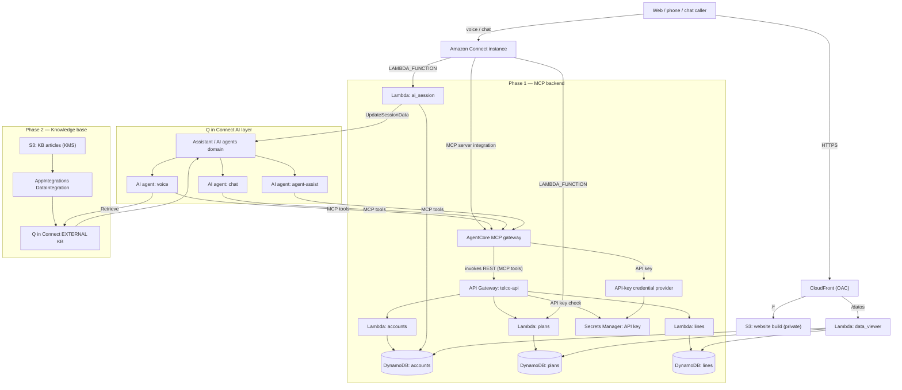
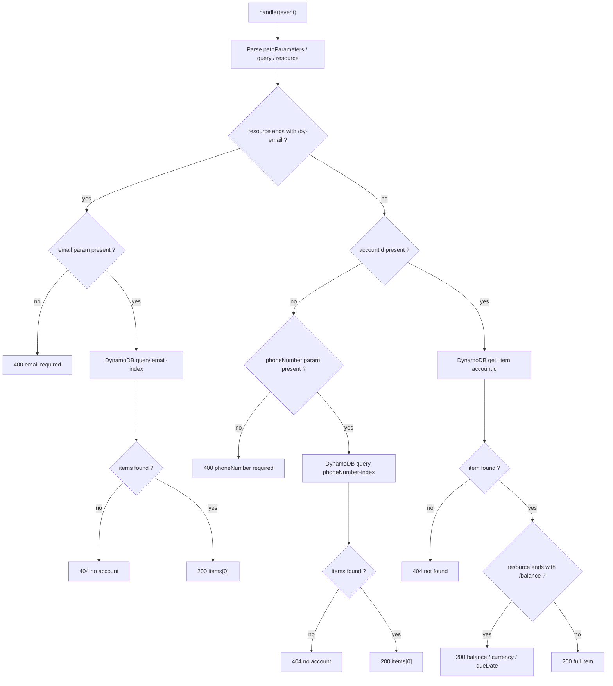
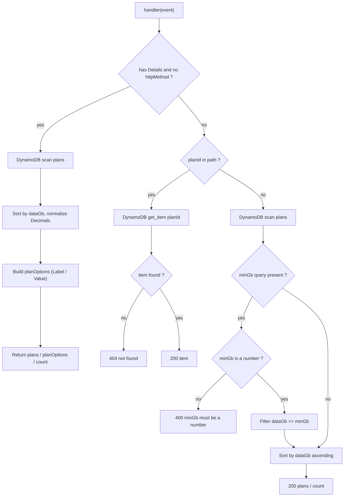
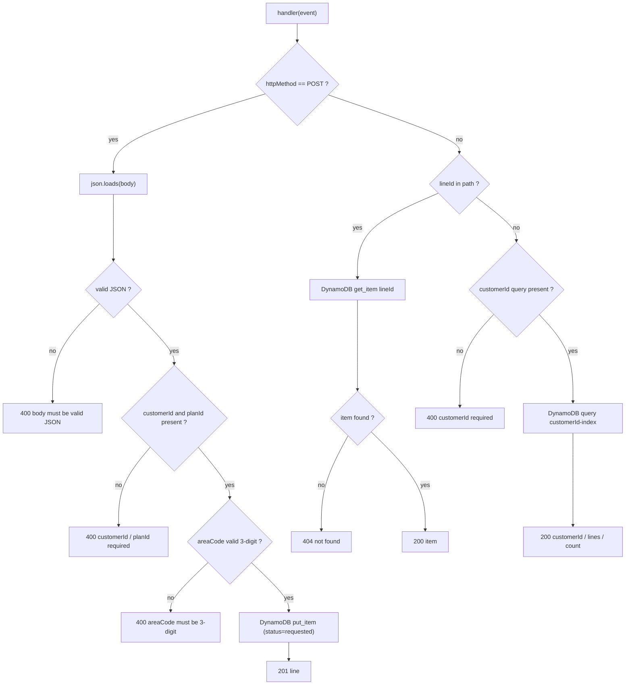
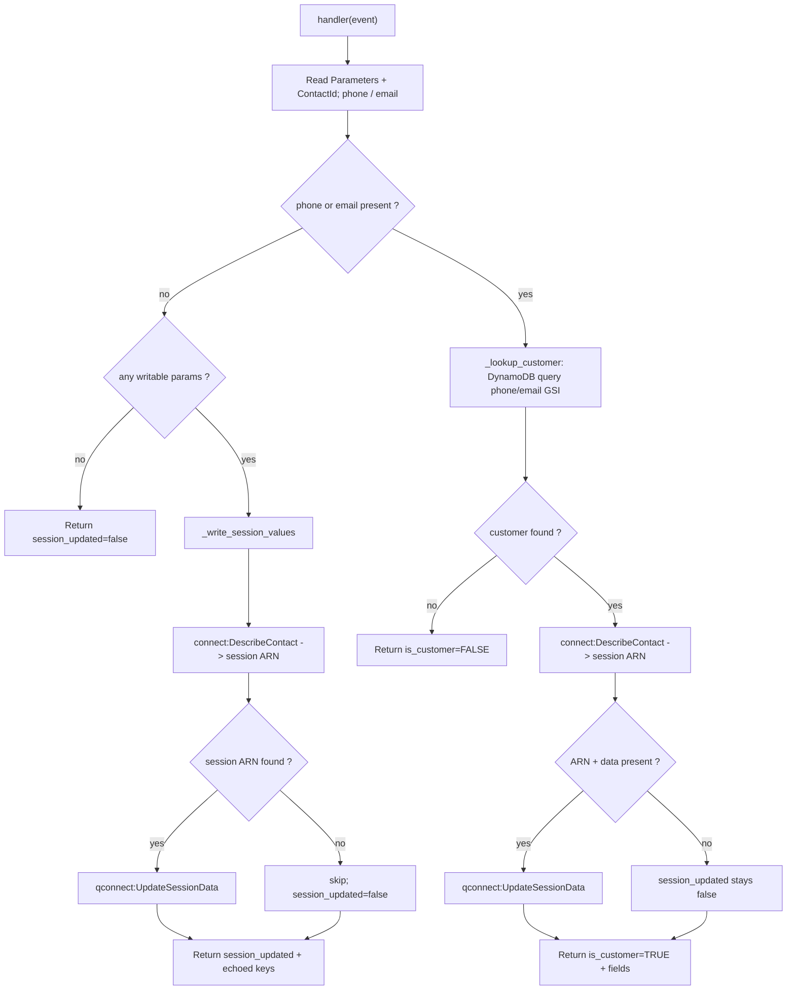
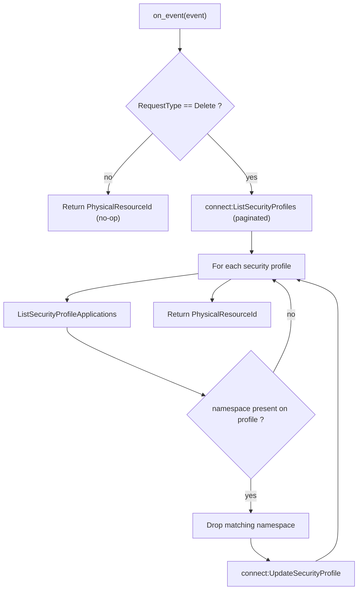
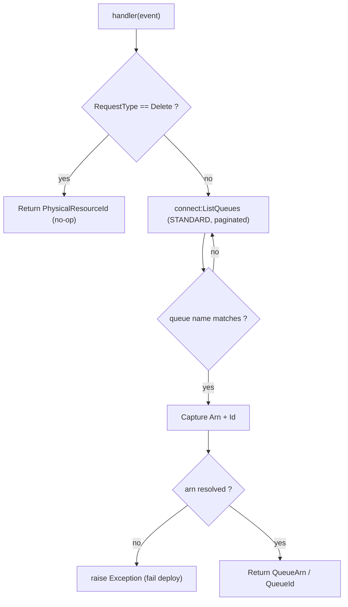
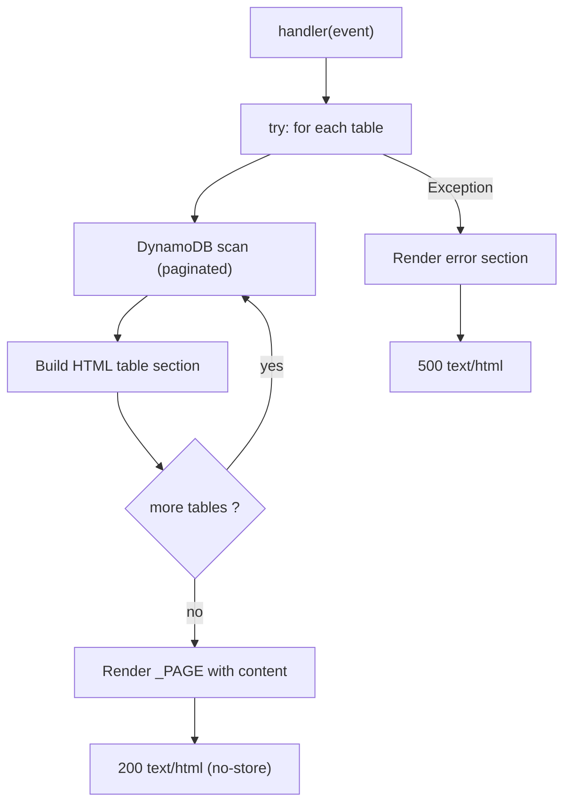

> 🌎 **Español:** [ver la versión en español (`README.md`)](README.md)

# agentic-cx-telco

A phased AWS CDK (Python) sample that stands up a **telco self-service backend**
and exposes it to **Amazon Connect AI agents** as an MCP server through a Bedrock
AgentCore gateway, plus a **Q in Connect knowledge base** for retrieval, the
**Connect supporting resources** (security profiles, views, guides, Lex bot,
contact flows) the agents use, and a static **"Latam Telco" website** that hosts
the Connect chat widget. The app is split into six small, decoupled stacks that
deploy independently and pass values to each other only through **SSM Parameter
Store** — no CloudFormation exports, no nested stacks.

| Deploy command | Stack | What it deploys |
|---|---|---|
| `cdk deploy CX-TELCO-MCP` | `McpStack` (Phase 1) | DynamoDB tables + sample data, the Lambda backend, the Telco REST API, the AgentCore MCP gateway, and the Amazon Connect MCP/Lambda integrations |
| `cdk deploy CX-TELCO-KB` | `KnowledgeBaseStack` (Phase 2) | The S3-backed EXTERNAL Q in Connect knowledge base (es/pt/en content) and its assistant association |
| `cdk deploy CX-TELCO-CONNECT-SUPPORT` | `ConnectSupportStack` (Phase 3) | The AI-agent security profiles, the customer-managed views, the eSIM step-by-step guide flow, and the Lex V2 Q-in-Connect passthrough bot |
| `cdk deploy CX-TELCO-AGENTS` | `AiAgentsStack` (Phase 4) | The Orchestration AI prompts and the three AI agents (self-service voice + chat, agent-assist) |
| `cdk deploy CX-TELCO-FLOWS` | `ContactFlowsStack` (Phase 5) | The escalation handoff view, screen-pop flow, the escalate + set-customer-session flow modules, and the Spanish self-service inbound flow |
| `cdk deploy CX-TELCO-WEBSITE` | `WebsiteStack` (Phase 6) | The static "Latam Telco" site (private S3 + CloudFront OAC), the Connect chat widget host, and the demo DynamoDB data-viewer Lambda |

---

## What Is Deployed

**Compute (Lambda)** — `accounts`, `plans`, `lines`, `ai_session` (telco backend), a
`ProfileDetacher` delete-time custom resource, a `BasicQueueLookup` deploy-time
custom resource, and the website `data_viewer`.

**Data** — three on-demand DynamoDB tables (`accounts`, `plans`, `lines`) seeded at
deploy time, an API key in Secrets Manager, a KMS-encrypted S3 bucket of knowledge
articles, and a private S3 bucket for the website build.

**APIs & gateways** — the `telco-api` REST API (API Gateway), a Bedrock **AgentCore
gateway** re-exposing it as an MCP server, and a CloudFront distribution (OAC) in
front of the website + data viewer.

**Amazon Connect / Q in Connect** — an EXTERNAL knowledge base + assistant
association, two AI-agent security profiles, three customer-managed views, a Lex V2
QInConnect passthrough bot, three AI agents (voice / chat / agent-assist) with their
orchestration prompts, and five contact flows / flow modules.

There are **no ECS tasks/services** and **no Step Functions state machines** in this
project — all compute is Lambda.



### Phase detail

**Phase 1 — `CX-TELCO-MCP`**
- **DynamoDB tables** for `accounts`, `plans`, and `lines` (on-demand, seeded with sample data at deploy time).
- **Lambda functions**: `accounts`, `plans`, `lines`, and `ai_session`.
- **REST API** (API Gateway) for telco operations, protected by an API key stored in **Secrets Manager**.
- **AgentCore Gateway** (Bedrock) that re-exposes the REST API as an **MCP server**, with an **API-key credential provider** and an inline OpenAPI target.
- **Amazon Connect integrations**: registers the gateway as an **MCP server application** on the Connect instance (plus a delete-time `ProfileDetacher` custom resource), and associates the `plans` + `ai_session` Lambdas (`LAMBDA_FUNCTION`).

**Phase 2 — `CX-TELCO-KB`**
- **KMS key + S3 bucket** holding the knowledge articles (uploaded by CDK under `telco/<lang>/`).
- **AppIntegrations DataIntegration** + **EXTERNAL Q in Connect knowledge base** that crawls the bucket.
- **Assistant association** binding the KB to the Q in Connect AI Agents domain so an agent's Retrieve tool can query it.

**Phase 3 — `CX-TELCO-CONNECT-SUPPORT`**
- **AI-agent security profiles** (self-service + agent-assist): least-privilege `Wisdom.View` + `CustomViews.Access`, plus the MCP tool grant built at deploy time from the gateway id.
- **Customer-managed views** (`AWS::Connect::View`): the new-line guided form and the eSIM activation guide.
- **eSIM guide contact flow**. The `AMAZON_CONNECT_GUIDE` content association that binds the flow to the `esim-activacion` KB content is created post-deploy by `knowledge_bases/associate_guide.py` (the content ids are post-ingestion values), not by the stack.
- **Lex V2 Q-in-Connect passthrough bot** (`AWS::Lex::Bot`): a single `AMAZON.QInConnectIntent` wired to the AI Agents assistant, 3 locales (en_US/es_US/pt_BR) on Nova Sonic v2 unified speech. The stack publishes the bot's built-in **TestBotAlias** ARN to SSM; build the three locales once in the console after deploy.

**Phase 4 — `CX-TELCO-AGENTS`**
- **Orchestration AI prompts** (`AWS::Wisdom::AIPrompt`), one per agent surface.
- **Three AI agents** (`AWS::Wisdom::AIAgent`, orchestration): self-service **voice** and **chat** (KB Retrieve + the 9 AgentCore MCP tools + Escalate/Complete; chat adds the new-line guide), and **agent-assist** (Retrieve + MCP surface only). Security-profile assignment to the agents is a **manual** post-deploy step.

**Phase 5 — `CX-TELCO-FLOWS`**
- **Escalation handoff view** (`AWS::Connect::View`) rendered on agent accept.
- **Screen-pop contact flow** that registers the handoff view as the `DefaultAgentUI`.
- **Flow modules**: `escalate-to-agent` (sets the screen-pop hook + target queue, transfers) and `set-customer-session-telco` (classifies the endpoint, looks the customer up via the `ai_session` Lambda, writes the Q in Connect session).
- **Inbound self-service flow**: the Spanish voice/chat entry flow that creates the Wisdom session, binds the Lex bot + the voice/chat/assist agents, drives the new-line guided form, and escalates to a human.
- **BasicQueueLookup** (`connect:ListQueues` custom resource) resolves the instance's queue ARN by name at deploy time.

**Phase 6 — `CX-TELCO-WEBSITE`**
- **Private S3 bucket + CloudFront (OAC)** serving the Vite build of the "Latam Telco" site, which hosts the Amazon Connect chat widget and passes the logged-in email as a contact attribute.
- **`data_viewer` Lambda** behind a CloudFront `/datos` behavior that renders the three DynamoDB tables as a read-only HTML page.

---

## Lambda Code Flows

Every deployed Lambda is Python 3.12 on ARM64. The four telco-backend functions
(`accounts`, `plans`, `lines`, `ai_session`) share a `_response()` / `_json_default`
helper that serializes DynamoDB `Decimal` values to native JSON numbers. **No handler
writes to `/tmp` or S3** — persistence is DynamoDB, Q in Connect session data, or
Connect security-profile state only.

### accounts

**Trigger:** API Gateway REST (proxy). Routes: `GET /accounts?phoneNumber=`,
`GET /accounts/by-email?email=`, `GET /accounts/{accountId}`,
`GET /accounts/{accountId}/balance`. Reads the `accounts` table (+ phone/email GSIs).



### plans

**Trigger:** DUAL. (a) API Gateway REST proxy: `GET /plans?minGb=`, `GET /plans/{planId}`.
(b) Amazon Connect **Invoke AWS Lambda function** (detected when the event has a
top-level `Details` key and no `httpMethod`). Reads the `plans` table.



### lines

**Trigger:** API Gateway REST proxy. Routes: `POST /lines`, `GET /lines?customerId=`,
`GET /lines/{lineId}`. Reads/writes the `lines` table (+ customerId GSI); generates
`lineId` server-side with `uuid4`.



### ai_session

**Trigger:** Amazon Connect `InvokeLambdaFunction` from the
`set-customer-session-telco` flow module. Returns a flat **STRING_MAP**. Reads the
`accounts` table (phone/email GSIs), calls `connect:DescribeContact` to find the
contact's Wisdom session ARN, and `qconnect:UpdateSessionData` to write attributes
into the Q in Connect session. All Connect/session failures are swallowed so a
personalization write never blocks the contact.



### ProfileDetacher (custom resource, delete-time)

**Trigger:** CloudFormation custom resource (`cr.Provider`) in the MCP stack. On
**Create/Update it is a no-op**; on **Delete** it strips this MCP application's
namespace (the gateway id) from every Connect security profile that still grants it,
so `DeleteIntegrationAssociation` can proceed automatically. Calls
`connect:ListSecurityProfiles`, `ListSecurityProfileApplications`, and
`UpdateSecurityProfile`.



### BasicQueueLookup (custom resource, deploy-time)

**Trigger:** CloudFormation custom resource in the FLOWS stack. Resolves the standard
queue ARN by name (`connect:ListQueues`, paginated) so the flows transfer to a valid
queue with no hard-coded id. Raises loudly if the named queue is not found.



### data_viewer (website)

**Trigger:** Lambda behind a CloudFront `/datos` behavior (API Gateway proxy with
OAC). Scans all three DynamoDB tables (`accounts`, `plans`, `lines`) with full
pagination and renders a single read-only HTML page in memory (no `/tmp`, no S3).
A single try/except returns a 500 HTML page on any error.



## ECS Task and Service Code Flows

None. This project deploys no ECS tasks or services.

## Step Functions Workflows

None. This project deploys no Step Functions state machines.

---

## Project Structure

```
agentic-cx-telco/
├── app.py                     # CDK app entry — wires the six phased stacks + dependencies
├── config.py                  # Flat module-level config, grouped by deploy phase (no secrets)
├── cdk.json                   # Runs `python3 app.py`
├── requirements.txt           # Runtime deps (aws-cdk-lib, constructs, PyYAML, boto3)
├── requirements-dev.txt       # Dev deps (pytest)
│
├── agentic_cx_telco/          # The six CDK stacks
│   ├── mcp_stack.py               # Phase 1  CX-TELCO-MCP
│   ├── knowledge_base_stack.py    # Phase 2  CX-TELCO-KB
│   ├── connect_support_stack.py   # Phase 3  CX-TELCO-CONNECT-SUPPORT
│   ├── ai_agents_stack.py         # Phase 4  CX-TELCO-AGENTS
│   ├── contact_flows_stack.py     # Phase 5  CX-TELCO-FLOWS
│   └── website_stack.py           # Phase 6  CX-TELCO-WEBSITE
│
├── lambdas/
│   ├── project_lambdas.py     # `Lambdas` construct (accounts / plans / lines / ai_session)
│   └── code/                  # Handler source, one folder per function
│       ├── accounts/handler.py
│       ├── plans/handler.py
│       ├── lines/handler.py
│       ├── ai_session/handler.py
│       └── data_viewer/index.py   # /datos data-viewer handler (per-industry branding)
│
├── apis/                      # Industry data: openapi/openapi.yaml + telco_api.py (REST route map)
├── databases/                # `Tables` construct (per-industry schema) + seed data (data/)
├── knowledge_bases/          # KB content (telco articles) + post-deploy scripts
│   ├── tag_kb_content.py          # post-deploy: tags KB content for Retrieve segmentation
│   └── associate_guide.py    # post-deploy: creates the AMAZON_CONNECT_GUIDE association
├── connect/                  # Connect industry data
│   └── agent_tools.py             # `AgentToolset`: MCP tool catalog, instructions, chat guide
├── connect_ai_agents/        # Authored orchestration prompt YAML per agent surface
├── flows/                    # Contact flow + module JSON (one folder per flow)
├── views/                    # Customer-managed view JSON (newline form / eSIM guide / handoff)
├── website/                  # Vite "Latam Telco" front-end (build output → website/dist)
├── shared/ssm_names.py       # The cross-stack SSM parameter-name contract
└── tests/unit/               # pytest scaffold
```

## Testing

Dev dependency is `pytest` (`requirements-dev.txt`). Run the suite from the project
root inside the virtualenv:

```bash
source .venv/bin/activate
pip install -r requirements-dev.txt
pytest tests/unit/
```

The current `tests/unit/test_agentic_cx_telco_stack.py` is the CDK-generated scaffold
(a `Template.from_stack` assertion example) and is not yet wired to the real phased
stacks. The intended approach is CDK **assertion tests** — synthesize a stack to a
CloudFormation template and assert on resource properties — which pairs well with the
"synth is the verification gate" workflow (`cdk synth` must pass before deploy).

## Configuration

All configuration is flat module-level constants in `config.py` (no secrets; AWS
credentials resolve from your local profile/SSO at deploy time), ordered by the deploy
phase that first consumes each value. Key groups: Connect identity (`INSTANCE_ID`,
`INSTANCE_ALIAS`, `ASSISTANT_ID`, `HAS_REAL_INSTANCE`), naming, KB settings, security
profiles, views/guide, Lex bot, AI agents/prompts/models, contact flows, and website
build settings. See `config.py` for the full annotated list.

### SSM parameters (the cross-stack contract)

Defined once in `shared/ssm_names.py`. Only values that genuinely cross a stack
boundary are published; everything else stays a `CfnOutput`. Secrets never go on the
bus (the API key stays in Secrets Manager).

| Parameter | Producer | Consumed by | Purpose |
|---|---|---|---|
| `/agentic-cx-telco/agentcore/gateway-id` | `CX-TELCO-MCP` | Phase 3 | bare gateway id (security-profile MCP namespace + Connect JWT audience) |
| `/agentic-cx-telco/agentcore/mcp-tool-prefix` | `CX-TELCO-MCP` | Phase 4 | `gateway_<id>__<target>___` prefix for agent MCP tool ids |
| `/agentic-cx-telco/agentcore/lambda/plans-arn` | `CX-TELCO-MCP` | Phase 5 | plans Lambda ARN (for contact flows) |
| `/agentic-cx-telco/agentcore/lambda/ai-session-arn` | `CX-TELCO-MCP` | Phase 5 | ai_session Lambda ARN (for contact flows) |
| `/agentic-cx-telco/kb/knowledge-base-id` | `CX-TELCO-KB` | script | KB id (read by `associate_guide.py`) |
| `/agentic-cx-telco/kb/assistant-association-id` | `CX-TELCO-KB` | Phase 4 | KB↔assistant association id (agent Retrieve binding) |
| `/agentic-cx-telco/connect/security-profile-selfservice-id` | `CX-TELCO-CONNECT-SUPPORT` | manual | self-service AI-agent security profile id |
| `/agentic-cx-telco/connect/security-profile-assist-id` | `CX-TELCO-CONNECT-SUPPORT` | manual | agent-assist security profile id |
| `/agentic-cx-telco/connect/view-newline-qualified-arn` | `CX-TELCO-CONNECT-SUPPORT` | Phase 5 | new-line form view ARN (inbound flow ShowView) |
| `/agentic-cx-telco/connect/lex-bot-alias-arn` | `CX-TELCO-CONNECT-SUPPORT` | Phase 5 | Lex bot TestBotAlias ARN for the inbound flow's Lex blocks |
| `/agentic-cx-telco/agents/voice-arn` | `CX-TELCO-AGENTS` | Phase 5 | self-service voice AI-agent ARN |
| `/agentic-cx-telco/agents/chat-arn` | `CX-TELCO-AGENTS` | Phase 5 | self-service chat AI-agent ARN |
| `/agentic-cx-telco/agents/assist-arn` | `CX-TELCO-AGENTS` | Phase 5 | agent-assist AI-agent ARN |

---

## Deploy

```bash
source .venv/bin/activate
pip install -r requirements.txt

# synth (verification gate) — cdk.json runs `python3 app.py`
cdk synth

# Phase 1 + Phase 2 — independent, deploy in any order
cdk deploy CX-TELCO-MCP --profile connect-industry
cdk deploy CX-TELCO-KB  --profile connect-industry

# Phase 3 — depends on Phase 1 (gateway id) and Phase 2 (kb id)
cdk deploy CX-TELCO-CONNECT-SUPPORT --profile connect-industry

# Phase 4 — depends on Phase 1 (MCP tool prefix) and Phase 2 (KB association)
cdk deploy CX-TELCO-AGENTS --profile connect-industry

# Phase 5 — depends on Phase 1 (ai_session Lambda), Phase 3 (view + Lex alias),
# and Phase 4 (agent ARNs)
cdk deploy CX-TELCO-FLOWS --profile connect-industry

# Phase 6 — build the site first, then deploy (S3 + CloudFront)
cd website && npm install && npm run build && cd ..
cdk deploy CX-TELCO-WEBSITE --profile connect-industry
```

### Post-deploy steps

After **Phase 4**, assign the Phase 3 security profiles to the AI agents (manual — there
is no native CFN resource for `connect:AssociateSecurityProfiles` with
`EntityType=AI_AGENT`):

1. In the **Amazon Connect admin website**, open **AI agents** (Q in Connect).
2. Assign profiles: voice + chat → `telco-selfservice-ai-agent`, agent-assist →
   `telco-agent-assist-iac`.
3. For **agent-assist**, the human agents who use the assistant panel must also carry
   the same permissions — tool calls authorize against the intersection of the AI
   agent's and the human agent's profiles.

After **Phase 2** finishes its first sync, tag the KB content so the Retrieve tool can
find it, then wire the eSIM guide to its article:

```bash
python knowledge_bases/tag_kb_content.py --wait --expect 21 --kb-id <kb-id> --profile connect-industry
python knowledge_bases/associate_guide.py --profile connect-industry   # add --dry-run to preview
```

After **Phase 3**, build the Lex bot's three locales (`en_US`, `es_US`, `pt_BR`) in the
Amazon Lex V2 console so its **TestBotAlias** goes live for the inbound flow (locales
are intentionally not auto-built to keep the deploy fast).
