# telco-selfservice-es-inbound — design

Host inbound voice flow for the `telco-selfservice-es-us` Connect AI
agent. Spanish self-service via a Nova Sonic Lex passthrough bot, with
an agent-driven escalation path to **BasicQueue**.

## Spec (stage 1)

| Field | Value |
|---|---|
| Name | `telco-selfservice-es-inbound` |
| Artifact kind | Flow |
| Channel | Voice (Nova Sonic is speech-to-speech — voice only) |
| Flow type | Inbound |
| Initiation method | INBOUND |
| Trigger | claimed phone number on instance `30b0e238-b3bd-4f61-9f04-c0b24e4a2f74` |
| Region | us-west-2 |

### Bound resources

| Resource | Value |
|---|---|
| AI agents domain (assistant) | `e1de1c2a-08ea-49e9-9dae-2ad3c80e78fd` |
| AI agent (qualified) | `c4c44be3-2c92-4e27-9ba1-352a3e29d705:1` |
| Lex bot | `telco-selfservice-bot`, alias `prod`, locale `es_US`, Nova Sonic v2 |
| Target queue | **BasicQueue** (placeholder ARN until provided) |

### Persona / voice
- Spanish (es-US). Persona lives in the AI agent prompt; the flow only
  sets the voice and hands off.
- `Set voice` → Polly **Lupe** (es-US), engine **generative**. Required
  because the Lex bot uses Speech-to-Speech (Nova Sonic). Lupe is the
  Nova Sonic-compatible Spanish voice. Mismatched voice + Nova Sonic is
  a silent config error the validator does not catch.

### Happy path
1. `Set logging behavior` → Enabled.
2. `Set recording and analytics behavior` → Voice, Contact Lens
   **RealTime**, language `es-US`. Required so the `Connect assistant`
   block works on the voice channel.
3. `Connect assistant` → binds the `telco-selfservice` domain.
4. `Set voice` → Lupe / generative.
5. `Get customer input` → Lex bot `telco-selfservice-bot` (es_US).
6. Bot turn ends → `Check contact attributes` on
   `$.Lex.SessionAttributes.Tool`.
7. `Escalate` → copy context → `Set working queue` (BasicQueue) →
   `Transfer to queue`.

### Branches (escalation contract)
The AI agent's `Escalate` Return-to-Control tool fires at the end of the
bot turn. Per the agentic self-service contract, the tool name lands in
`$.Lex.SessionAttributes.Tool` and each input parameter lands in
`$.Lex.SessionAttributes.<paramName>`.

- **`Tool` == `Escalate`** → `Set contact attributes` copies the
  escalation context (8 fields, see below)
  → **`escalate-to-agent` module** (registers the agent screen-pop UI,
  sets BasicQueue, transfers to queue) → `Disconnect`.
- **`Tool` == `Complete`** → `copy-complete-context` (captures
  `completionReason` / `resolutionSummary` / `topicsDiscussed` from
  the custom Complete tool) → goodbye prompt → `Disconnect`.
- **`Tool` no match** → `Set working queue` → `Transfer to queue`
  (fail safe to a human rather than dead-end).
- **`Get customer input` Error / Timeout** → `Set working queue` →
  `Transfer to queue` (don't strand the caller).
- **`Transfer to queue` QueueAtCapacity** → "todos ocupados" prompt →
  `Disconnect`.

### Integrations
- Connect AI agents domain `e1de1c2a-...` (us-west-2).
- Lex V2 passthrough bot delegating to the same Q-in-Connect assistant.

### Escalation
Agent-driven. The AI agent decides when to escalate (out-of-scope,
account access, frustration, explicit human request) and emits the
`Escalate` tool. The flow turns that into a BasicQueue transfer with
the escalation context attached for the agent screen pop.

**Escalation context — 8 fields (v3).** The `Escalate` tool captures
4 required + 4 optional fields; `copy-context` copies all of them from
`$.Lex.SessionAttributes.*` to contact attributes:

| Field | Required | Purpose |
|---|---|---|
| `escalationReason` | yes | Category enum |
| `escalationSummary` | yes | Spanish summary for the agent |
| `customerIntent` | yes | What the customer wants |
| `sentiment` | yes | positive / neutral / frustrated |
| `escalationPriority` | no | low / normal / high (screen-pop urgency; attribute-only) |
| `resolutionAttempted` | no | What self-service already tried |
| `recommendedAction` | no | Bot's suggested next step for the agent |
| `topicsDiscussed` | no | Comma-separated topics covered |

`escalationPriority` is attribute-only for now; to drive queue
priority, add a `Change routing priority` block branching on it.

### Agent screen-pop handoff (Views realm)

On escalation, the receiving human agent gets a screen pop showing all
8 escalation fields. This is wired with three additional artifacts (the
pattern was learned from a reference instance — the customer flow does
**not** contain an inline `ShowView`):

| Artifact | ID | Role |
|---|---|---|
| View `TelcoEscalationHandoff` | `ef8070cb-0306-435a-af6c-201e23532306` | Customer-managed view, display-only, 2-col layout. See `projects/telco-cx/views/telco-escalation-handoff/`. |
| Flow `telco-agent-screenpop-es` | `42e1ab22-bb19-4467-9645-914854e1049b` | `DefaultAgentUI` event-hook flow. Its `ShowView` block mounts the view on agent accept. |
| Module `escalate-to-agent` | `0a162083-8cdd-4916-947f-bc99b54dff4c` | Registers the screen-pop flow as the `DefaultAgentUI` hook, sets BasicQueue, transfers to queue. |

Data flow:

```
copy-context (parent: $.Lex.SessionAttributes.* → 8 contact attributes)
  → escalate-to-agent module
       UpdateContactEventHooks DefaultAgentUI → telco-agent-screenpop-es
       UpdateContactTargetQueue → BasicQueue
       TransferContactToQueue
  → (on agent accept) Connect runs telco-agent-screenpop-es
       ShowView maps $.Attributes.* → view's $.<flat keys>
```

**Why `copy-context` stays in the parent:** flow modules cannot read
`$.Lex.SessionAttributes.*`. So the parent flow copies the Lex session
attributes into plain contact attributes first; the module and the
screen-pop flow then consume those contact attributes. See
`projects/_samples/flows/escalate-to-agent/design.md` and
`projects/telco-cx/flows/telco-agent-screenpop-es/design.md` for the per-artifact detail
and deploy learnings.

**Completion context (custom `Complete` tool).** The agent also
carries a custom `Complete` Return-to-Control tool (mirrors the sample
agent, enriched). On the `Complete` branch, `copy-complete-context`
captures these to contact attributes for containment/CSAT analytics:

| Field | Required | Contact attribute | Purpose |
|---|---|---|---|
| `reason` | yes | `completionReason` | Why self-service closed (enum) |
| `resolutionSummary` | no | `resolutionSummary` | What was resolved/delivered |
| `topicsDiscussed` | no | `topicsDiscussed` | Topics covered |

Completed (contained) contacts now carry *why* they were contained on
the CTR, not just a silent disconnect.

### Edge cases
- Customer silent (Timeout) → still transfer to queue.
- Lex/bot error → transfer to queue.
- Queue at capacity → apology prompt → disconnect.

### Success criteria
Spanish bot answers contained requests; escalations reach a human in
BasicQueue with `escalationReason` / `escalationSummary` /
`customerIntent` / `sentiment` populated on the contact.

## Deployed (stage 4)

Live on instance `30b0e238-b3bd-4f61-9f04-c0b24e4a2f74` (us-west-2,
profile `connect-chat`), deployed 2026-06-03.

| Resource | Value |
|---|---|
| Contact flow ID | `4a9d1df0-6bcd-4311-8c64-bb3c2c9c163a` |
| Lex bot | `telco-selfservice-bot` botId `7X5ITLG1ZT`, version `1`, alias `prod` (`DQCOR7Y8MN`) |
| Lex alias ARN | `arn:aws:lex:us-west-2:643504311277:bot-alias/7X5ITLG1ZT/DQCOR7Y8MN` |
| Bot ↔ instance | associated ✓ |
| BasicQueue | `6c6b0460-1fc7-4ffe-bce4-be9c6721380e` |
| AI agents domain | `e1de1c2a-08ea-49e9-9dae-2ad3c80e78fd` |

Two Connect-side validation fixes applied during deploy (the
structural validator does not catch these):

1. `ConnectParticipantWithLexBot` requires at least one of
   `PromptId` / `Text` / `SSML` / `Media` / `LexInitializationData`.
   Added a Spanish opening `Text` prompt.
2. `TransferContactToQueue` requires `Transitions.NextAction` to be
   present (success path), not just Errors. Pointed it at
   `disconnect`.

### Post-deploy corrections (made in the console, synced back to `flow.json`)

The repo `flow.json` is the live flow pulled with `describe-contact-flow`
after these fixes. Three corrections matter for anyone reusing the
pattern:

1. **Bot turn exits via Default, not Success.** The Q-in-Connect
   passthrough bot returns the `AmazonQinConnect` intent, which matches
   no intent *condition* on the Get customer input block. So the bot
   turn leaves through the block's **Default / `NoMatchingCondition`**
   branch. The `check-tool` Compare hangs off that branch
   (`get-input` → Error `NoMatchingCondition` → `check-tool`), not off
   Success. The original wired it off Success and the escalation logic
   never ran. This is the single most important wiring detail in the
   pattern.
2. **Set voice engine = `Generative`** (capital G), required for Nova
   Sonic. The block is followed by a `UpdateContactData` setting
   `LanguageCode: es-US` (the designer's "override language attribute"
   toggle) so Lex and TTS agree on locale.
3. **Lex bot tag value is case-sensitive: `AmazonConnectEnabled=True`**
   (capital T). Lowercase `true` is accepted by the flow dropdown /
   runtime, but the Connect admin **bot-management page**
   (`/bots/details/<botId>`) does a case-sensitive check and returns
   403 ("The Conversational AI bot does not have the required tag set")
   for any other casing. Discovered by diffing a console-created bot
   (`True`) against the imported bot (`true`). The deploy script now
   stamps `True` automatically.
4. **"Enable AI Agent" toggle on Get customer input — required to pin
   the agent.** Checking this toggle in the designer expands the Get
   customer input block into a three-Action fragment:
   `CreateWisdomSession` (binds the domain) → `UpdateContactData`
   (writes `WisdomSessionArn`) → `ConnectParticipantWithLexBot`, and
   adds this session attribute to the Lex call:

   ```json
   "LexSessionAttributes": {
     "x-amz-lex:q-in-connect:ai-agent-arn":
       "arn:aws:wisdom:us-west-2:643504311277:ai-agent/e1de1c2a-...:$LATEST"
   }
   ```

   That `ai-agent-arn` attribute is what pins **this specific
   orchestration agent + version**. Without it, the Q-in-Connect path
   runs the assistant's *default* SELF_SERVICE agent — which is why
   the flow appeared to do nothing useful until the toggle was
   enabled. With it, open item #2 (must-be-default) is no longer
   strictly required, because the agent is selected on the block. The
   repo `flow.json` reflects this (the bot turn now starts at the
   `connect-assistant`/`get-input` `CreateWisdomSession` fragment).
   The `validate_flow_json` MCP tool now emits a warning when a
   `ConnectParticipantWithLexBot` Action is missing this attribute.

## Open items / deploy dependencies

1. ~~**BasicQueue ARN**~~ — resolved:
   `6c6b0460-1fc7-4ffe-bce4-be9c6721380e`.
2. **AI agent must be the SELF_SERVICE default.** `.last-deploy.json`
   shows `setAsDefault: false`. The Connect-assistant + Lex path runs
   the assistant's default SELF_SERVICE agent. Re-run the agent
   `deploy.sh` with `SET_DEFAULT=true` so this telco agent is the one
   that runs. **Still required for the telco agent to actually run.**
3. **Contact Lens** enabled on the instance (needed for the realtime
   analytics block on voice).
4. ~~**Lex bot** built + `prod` alias associated~~ — resolved
   (botId `7X5ITLG1ZT`, alias `prod`, associated). All three locales
   (`en_US`, `es_US`, `pt_BR`) are built and enabled on the alias.
5. **Claim a phone number** and point its inbound flow at
   `telco-selfservice-es-inbound` to take live calls.

## Design (stage 2) — Mermaid

> **Corrected after deploy.** The Q-in-Connect passthrough bot returns
> the `AmazonQinConnect` intent, which matches no intent *condition* on
> the Get customer input block — so the bot turn always exits via the
> block's **Default / NoMatchingCondition** branch, NOT Success. The
> `check-tool` Compare must hang off that branch. Wiring it off Success
> (the intuitive but wrong choice) means the escalation logic never
> runs. The Set voice block also uses engine **Generative** (Nova Sonic
> requirement) and is followed by a language-attribute set to `es-US`.

```mermaid
graph LR
    Start([Start]) --> Log[Set logging behavior<br/>UpdateFlowLoggingBehavior: Enabled]
    Log --> CL[Set recording and analytics behavior<br/>Voice / Contact Lens RealTime / es-US]
    CL -->|Success| Assist[Connect assistant<br/>CreateWisdomSession<br/>domain: telco-selfservice]
    CL -->|Error| Assist
    Assist -->|Success| Voice[Set voice<br/>Polly Lupe / Generative<br/>+ language attribute es-US]
    Assist -->|Error| Voice
    Voice -->|Success| Input[Get customer input<br/>ConnectParticipantWithLexBot<br/>telco-selfservice-bot alias prod / es_US / Nova Sonic<br/>opening Text prompt required]
    Voice -->|Error| Input
    Input -->|Default / NoMatchingCondition: bot turn ends| CheckTool[Check contact attributes<br/>Compare $.Lex.SessionAttributes.Tool]
    Input -->|Error: NoMatchingError| SetQueue
    CheckTool -->|Equals 'Escalate'| CopyCtx[Set contact attributes<br/>copy escalationReason / escalationSummary<br/>customerIntent / sentiment from Lex]
    CheckTool -->|Equals 'Complete'| Bye[Play prompt<br/>'Gracias por llamar. Hasta luego.']
    CheckTool -->|No match| SetQueue
    CopyCtx -->|Success| SetQueue[Set working queue<br/>BasicQueue]
    CopyCtx -->|Error| SetQueue
    SetQueue -->|Success| Xfer[Transfer to queue<br/>TransferContactToQueue]
    SetQueue -->|Error| Disc
    Xfer -->|Success| Disc
    Xfer -->|Error: QueueAtCapacity| Full[Play prompt<br/>'Todos los representantes estan ocupados.']
    Xfer -->|Error: NoMatchingError| Disc
    Bye --> Disc([Disconnect / hang up])
    Full --> Disc
```



## Block → Action mapping (preview for stage 3)

| Mermaid node | UI block | Flow language Action |
|---|---|---|
| Set logging behavior | Set logging behavior | `UpdateFlowLoggingBehavior` |
| Set recording and analytics behavior | Set recording and analytics behavior | `UpdateContactRecordingAndAnalyticsBehavior` |
| Connect assistant | Connect assistant | `CreateWisdomSession` |
| Set voice | Set voice | `UpdateContactTextToSpeechVoice` |
| Get customer input | Get customer input | `ConnectParticipantWithLexBot` |
| Check contact attributes | Check contact attributes | `Compare` |
| Set contact attributes | Set contact attributes | `UpdateContactAttributes` |
| Set working queue | Set working queue | `UpdateContactTargetQueue` |
| Transfer to queue | Transfer to queue | `TransferContactToQueue` |
| Play prompt | Play prompt | `MessageParticipant` |
| Disconnect / hang up | Disconnect / hang up | `DisconnectParticipant` |
