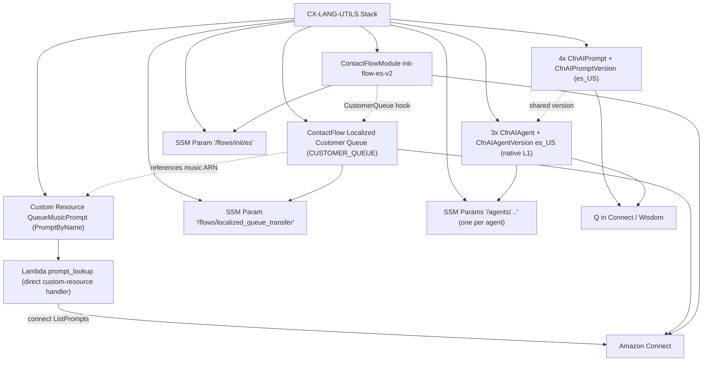
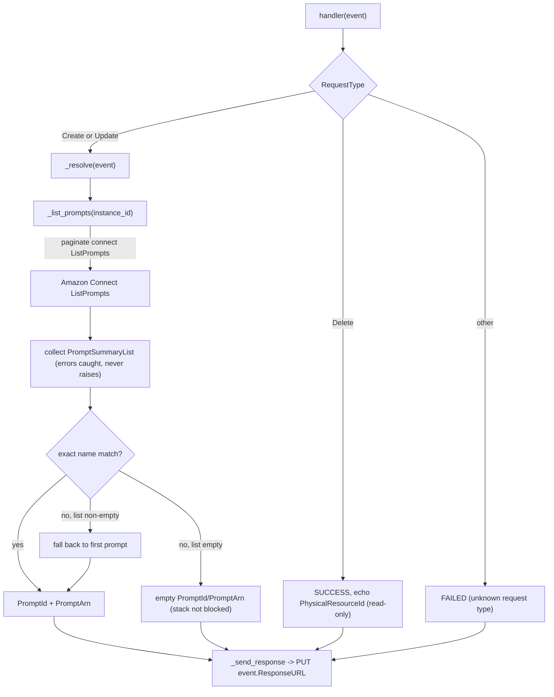

# general-localization (`CX-LANG-UTILS`)

A CDK (Python) app that deploys an Amazon Connect **localized customer-queue
experience** plus a set of **localized Q in Connect AI prompts and utility AI
agents**, for a phased multi-locale rollout (`en_US`, `es_US`, `pt_BR`).

The stack is `GeneralLocalizationStack` (stack name `CX-LANG-UTILS`, see
`app.py`). It synthesizes **fail-closed**: `_resolve_config()` validates every
mandatory config value before any construct is created, so a missing/blank
value raises `ConfigError` and the stack emits no template.

> The `get-customer-endpoint` module, its `Session_Data_Lambda`, and
> `endpoint_router.py` were **removed** from this project (consolidated into
> `telco-cx`). They are not part of this stack.

---

## What Is Deployed

Everything below lives in the single `CX-LANG-UTILS` CloudFormation stack.

- **Localized customer-queue contact flow** — one `CfnContactFlow` of type
  `CUSTOMER_QUEUE` named `Localized Customer Queue`. It branches internally on
  the contact's `$.LanguageCode` and plays a per-language hold message + Polly
  TTS voice, defaulting to English. Rendered from
  `flows/localized-customer-queue/flow.json` with hold-message / TTS / music
  markers substituted at synth.
- **`init-flow-es-v2` contact flow module** — one `CfnContactFlowModule` ported
  from the live `init-flow-es` module. Enables flow logging, sets the localized
  queue flow as the `CustomerQueue` event hook, and configures per-channel
  recording/analytics. Rendered from `flows/init-es/flow.json`.
- **Queue hold-music prompt lookup** — a `Custom::ConnectPromptByName` custom
  resource (`QueueMusicPrompt`) that resolves the hold-music prompt ARN by name
  at deploy time (prompt ids are instance-specific). Backed by the
  **`prompt_lookup` Lambda** + a CDK `Provider`.
- **Localized Q in Connect AI prompts** — four native `CfnAIPrompt` +
  `CfnAIPromptVersion` chains per enabled non-English locale (currently
  `es_US`): query reformulation, answer generation (shared), intent labeling,
  note taking. Bodies loaded verbatim from `prompts/*.yaml`.
- **Localized Q in Connect utility AI agents** — three native `CfnAIAgent`
  (`AWS::Wisdom::AIAgent`) + `CfnAIAgentVersion` resources per enabled
  non-English locale: Answer Recommendation, Manual Search, Note Taking. Each
  wires the published prompt versions above (Answer Recommendation and Manual
  Search share the same answer-generation version). No boto3 custom resource is
  used: the native path works because these utility agents carry no tool
  configurations (the only `AWS::Wisdom::AIAgent` failure mode — a stringified
  `maxLength` in a tool `inputSchema` — does not apply, and the empty
  `outputFilters: []` the provider injects is benign). Note: `suggestedMessages`
  is not set on the Answer Recommendation agent — the CloudFormation
  `AWS::Wisdom::AIAgent` resource does not expose that property.
- **SSM parameters** — the queue flow ARN (`/flows/localized_queue_transfer`),
  the init flow module ARN (`/flows/init/es`), and one parameter per created AI
  agent under `/agents/...`.
- **CfnOutputs** — one ARN output per created resource (queue flow, init flow
  module, each AI prompt, each AI agent).



---

## Lambda Code Flows

The single Lambda is a **CloudFormation custom-resource** handler (invoked at
deploy/update/delete time) — not a request/runtime API. It is wired DIRECTLY as
the custom resource's `ServiceToken` (no `cr.Provider` framework Lambda), so the
handler sends its own CloudFormation response. It does not use `/tmp` or S3.

### `prompt_lookup` Lambda

Asset: `connect/prompt_lookup_lambda/index.py` (wired by
`connect/prompt_lookup_cr.py`). **Trigger:** CloudFormation custom resource
(direct Lambda service token). Resolves an Amazon Connect prompt id/ARN by name
and PUTs the SUCCESS/FAILED result to the pre-signed `event["ResponseURL"]`.



---

## ECS Tasks / Services

**None.** This stack deploys no ECS clusters, task definitions, or services.

## Step Functions

**None.** This stack deploys no Step Functions state machines.

---

## Project Structure

```text
general-localization/
├── app.py                          # CDK app entry; instantiates CX-LANG-UTILS stack
├── cdk.json                        # CDK Toolkit config (python app.py)
├── config.py                       # Flat module-level configuration constants
├── config_validation.py            # Pure fail-closed validators (require / parse_bool / hold-message)
├── language_router.py              # Pure $.LanguageCode -> queue path selector (mirrors the flow's Compare block)
├── general_localization/
│   └── general_localization_stack.py   # GeneralLocalizationStack: composes all resources
├── connect/                        # All Amazon Connect / Q in Connect constructs
│   ├── flows.py                    # ContactFlow + ContactFlowModule constructs
│   ├── ai_agents.py                # Localized prompt + agent factory (4 prompts, 3 native agents per locale)
│   ├── prompt_lookup_cr.py         # PromptByName: ListPrompts-by-name custom-resource construct
│   └── prompt_lookup_lambda/
│       └── index.py                # Custom-resource handler: resolve prompt id/ARN by name
├── flows/
│   ├── localized-customer-queue/
│   │   └── flow.json               # Localized customer-queue Flow-language JSON (markers substituted at synth)
│   └── init-es/
│       └── flow.json               # init-flow-es-v2 contact flow module JSON
├── prompts/                        # AI prompt template bodies (loaded verbatim)
│   ├── query_reformulation.yaml
│   ├── answer_generation.yaml
│   ├── intent_labeling.yaml
│   └── note_taking.yaml
├── tests/
│   └── unit/                       # pytest + Hypothesis property tests + assertions.Template tests
├── requirements.txt                # aws-cdk-lib, constructs, pytest, hypothesis
└── requirements-dev.txt            # dev/test extras
```

---

## Testing

Tests live under `tests/unit` and run with `pytest` inside the project `.venv`:

```bash
source .venv/bin/activate
pip install -r requirements.txt
pytest tests/unit
```

The suite mixes **Hypothesis property tests**, **CDK `assertions.Template`
synthesis tests**, and **fail-closed config tests**:

- `test_property_1_absence.py` — `is_absent` / `require` absence handling.
- `test_property_2_hold_message.py` — hold-message validation (non-blank, 3000-char ceiling).
- `test_property_3_flow_rendering.py` — flow-marker substitution stays valid JSON.
- `test_property_4_language_router.py` — `language_router.select_queue_experience` never raises and routes every `$.LanguageCode` variant correctly.
- `test_property_6_parse_bool.py` — truthy-token parsing defaults missing/unrecognized to disabled.
- `test_property_7_locale_build_set.py` — enabled-locale set drives the built prompt/agent set.
- `test_property_8_outputs_correspondence.py` — CfnOutputs correspond exactly to created resources.
- `test_config_fail_closed.py` — a missing/blank required value raises `ConfigError` and the stack defines no resources.
- `test_general_localization_stack.py`, `test_stack_template.py` — `assertions.Template` checks over the synthesized template (native `AWS::Wisdom::AIAgent` + `AWS::Wisdom::AIAgentVersion`).

---

## Configuration

All configuration is flat module-level constants in `config.py` (no secrets;
AWS credentials resolve from your local profile/SSO at deploy time).

Key constants:

- `INSTANCE_ID`, `ASSISTANT_ID` — Connect instance + Q in Connect assistant the
  resources are created under (placeholder UUIDs synthesize offline).
- `LOCALES` — `{"en_US": True, "es_US": True, "pt_BR": False}`. `en_US` is always
  enabled for the queue experience; the AI-agent rollout iterates enabled
  non-English locales (currently `es_US`). Enabling `pt_BR` extends the build
  with no code change.
- `AGENT_LOCALE_OVERRIDES` — optional per-agent locale pin (e.g.
  `{"ANSWER_RECOMMENDATION": "es_ES"}`).
- `SUGGESTED_MESSAGES` — reference Answer Recommendation `suggestedMessages`
  (not wired: the native `AWS::Wisdom::AIAgent` resource has no such property).
- `HOLD_MESSAGE_EN` / `HOLD_MESSAGE_ES` / `HOLD_MESSAGE_PT` — per-language hold
  texts (non-blank, ≤ 3000 chars).
- `TTS_VOICE_EN` / `TTS_VOICE_ES` / `TTS_VOICE_PT` / `TTS_ENGINE` — Polly voices
  + engine for each language path.
- `QUEUE_MUSIC_PROMPT_NAME` — hold-music prompt resolved by name at deploy time.
- `INIT_FLOW_MODULE_NAME` — `init-flow-es-v2` (the `-v2` suffix avoids colliding
  with the original module in the instance).

### Published SSM parameter names

| Constant | Value | Holds |
| --- | --- | --- |
| `QUEUE_FLOW_PARAM_NAME` | `/flows/localized_queue_transfer` | Localized queue flow ARN |
| `INIT_FLOW_PARAM_NAME` | `/flows/init/es` | `init-flow-es-v2` module ARN |
| `AGENT_PARAM_PREFIX` | `/agents` | One param per agent, e.g. `/agents/answer_recommendation_es_US` |

---

## Useful Commands

- `cdk ls` — list stacks (`CX-LANG-UTILS`)
- `cdk synth` — emit the synthesized CloudFormation template
- `cdk deploy` — deploy to your default account/region
- `cdk diff` — compare deployed stack with current state
- `pytest tests/unit` — run the test suite
